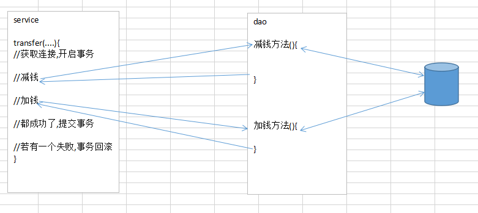
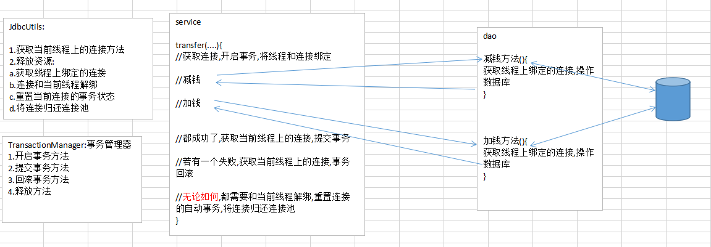

# Spring02

# Spring的注解开发

使用Spring的纯xml配置方式时，每添加一个Dao或者是Service，都需要将其交给spring进行管理，即需要在spring的配置文件中配置一个bean标签，影响开发效率，同时会导致配置文件臃肿。Spring提供了一些注解，用来代替<bean>的配置，可以大大提高开发效率。所以注解开发是一种趋势，注解代替xml配置文件 ，==简化配置==。

## Spring的常用注解

| 注解           | 说明                                        |
| -------------- | ------------------------------------------- |
| @Component     | 使用在类上用于实例化Bean                    |
| @Controller    | 使用在web层类上用于实例化Bean               |
| @Service       | 使用在service层类上用于实例化Bean           |
| @Repository    | 使用在dao层类上用于实例化Bean               |
| @Autowired     | 使用在字段上用于根据类型依赖注入            |
| @Qualifier     | 结合@Autowired一起使用,根据名称进行依赖注入 |
| @Value         | 注入普通属性                                |
| @Scope         | 标注Bean的作用范围                          |
| @PostConstruct | 使用在方法上标注该方法是Bean的初始化方法    |
| @PreDestroy    | 使用在方法上标注该方法是Bean的销毁方法      |


### 配置组件扫描

需要在Spring的主配置文件中配置组件扫描，以上注解才能被解析

```xml
<?xml version="1.0" encoding="UTF-8"?>
<beans xmlns="http://www.springframework.org/schema/beans"
       xmlns:xsi="http://www.w3.org/2001/XMLSchema-instance"
       xmlns:context="http://www.springframework.org/schema/context"
       xsi:schemaLocation="http://www.springframework.org/schema/beans
       http://www.springframework.org/schema/beans/spring-beans.xsd
       http://www.springframework.org/schema/context
       https://www.springframework.org/schema/context/spring-context.xsd">

    <!--开启组件扫描：扫描指定包下使用了Spring注解的类-->
    <context:component-scan base-package="com.bjpowernode" />
</beans>
```

### 使用在类上的注解

@Component: 组件 替代bean标签

* 三个==别名==注解
  * @Controller : 作用在==web==层的类上
  * @Service : 作用在==service==层的类上
  * @Repository : 作用在==dao==层的类上

```java
//@Component("userDao") // userDao是实例在IOC容器中的唯一标识
//@Component //若不指定值,id就是类名的首字母小写
@Repository  // 建议
public class UserDaoImpl implements UserDao {
    public void save() {
        System.out.println("dao中的save方法");
    }
}
```


---

@Scope:声明类对应的对象的作用范围

```java
//@Scope
//@Scope("singleton") //默认就是单实例 所以value可以不写,甚至Scope注解也可以不写
//@Scope("prototype")
public class UserDaoImpl implements UserDao {
    public void save() {
        System.out.println("dao中的save方法");
    }
}
```


### 使用在方法上的注解(了解)


```xml
<bean id="" class="" init-method="init" destory-method="destory" />
```

```java
@PostConstruct //相当于init-method属性
public void init(){
    System.out.println("初始化");
}

@PreDestroy //相当于destory-method属性
public void destory(){
    System.out.println("销毁");
}
```


### 使用在成员变量上的注解-注入(掌握)

==不需要提供set方法==

@Value("值"): 注入基本类型和string类型

@Autowired : 注入已在spring容器中的引用类型

```java
@Service
public class UserServiceImpl implements UserService {
    @Value("tom")
    private String username;
    @Value("18")
    private int age;

    @Autowired // 默认按类型匹配，如果匹配到多个结果，则将 字段名 作为ID进行唯一匹配
    @Qualifier("userDao2") //搭配@Autowired注解就可以按照指定的value属性值匹配唯一的结果
    private UserDao userDao;

    public void save() {
        System.out.println("service执行了save操作:"+username+"  "+age);
        userDao.save();
    }
}

```

--------


### 扩展: @Resource

该注解不是Spring的注解，如果在字段上添加该注解，Spring也会解析

```java
//@Resource   // 默认以 字段名 作为ID去IOC容器中匹配，如果不存在则按类型匹配，匹配不到或匹配多个相同类型，报异常
@Resource(name="userDao2")   //根据类型和ID进行匹配，相当于@Autowired 和 @Qulifiler
private OrderDao orderDao;
```


面试题：@Autowired注解和@Resource注解有什么区别？

	1. @Autowired是spring提供的注解，@Resource是JDK提供的注解
	2. @Autowired，默认根据类型进行匹配，如果匹配到多个相同类型，则根据字段名作为ID去Spring的IOC容器中匹配
	3. @Resource，默认根据字段名作为ID进行唯一匹配，如果匹配不到则根据类型进行匹配，如果匹配不到或者是匹配到多个相同类型，则报异常，@Resource还可以指定name（唯一标识）和type（类型）进行匹配


用Autowired还是Resource？看个人喜好！


## 使用spring常用注解整合DBUtils（掌握）

### 转账案例步骤

	1. 新建maven工程：spring02_dbutils_anno_xml
	2. 导入依赖：spring-context, mysql, druid, junit, dbutils
	3. 复制jdbc.properties到resources目录下
	4. 创建Spring的主配置文件
	  - 配置组件扫描
	  - 引入jdbc.properties
	  - 配置DataSource
	  - 配置QueryRunner，需要注入DataSource
	5. 编写Dao及实现类，在实现类上加@Repository
	- Dao中需要使用QueryRunner，因此需要使用@AutoWired或者是@Resource注解注入QueryRunner
	6. 编写Service和实现类，在实现类上加@Service
	- Service需要调用Dao，因此还需要使用@AutoWired或者是@Resource注解注入Dao
	7. 测试！


### 代码

AccountDao

```java
@Repository
public class AccountDaoImpl implements AccountDao {
    @Autowired
    private QueryRunner queryRunner;
    @Override
    public Account findById(Integer id) throws SQLException {
        String sql = "select * from account where id = ?";
        return queryRunner.query(sql,new BeanHandler<Account>(Account.class),id);
    }
}
```

AccountService

```java
@Service
public class AccoutServiceImpl implements AccountService {
    @Autowired
    private AccountDao accountDao;
    @Override
    public Account findById(Integer id) throws SQLException {
        return accountDao.findById(id);
    }
}
```

applicationContext.xml

```xml
<!--开启组件扫描-->
<context:component-scan base-package="com.bjpowernode"/>

<!--使用context约束中的property-placeholder 加载properties文件-->
<context:property-placeholder location="classpath:jdbc.properties"/>

<!--配置数据源-->
<bean id="dataSource" class="com.alibaba.druid.pool.DruidDataSource">
    <!--使用spring的el表达式获取已加载的配置文件中的数据-->
    <property name="driverClassName" value="${jdbc.driver}"/>
    <property name="url" value="${jdbc.url}"/>
    <property name="username" value="${jdbc.username}"/>
    <property name="password" value="${jdbc.password}"/>
</bean>

<!--配置QueryRunner-->
<bean id="runner" class="org.apache.commons.dbutils.QueryRunner">
    <constructor-arg name="ds" ref="dataSource"/>
</bean>
```

小结:

将我们自己编写的类使用ioc和di(依赖注入)注解替代.但是QueryRunner和DruidDatasource两个类不是我们编写的,是第三方编写,没有办法在他们上面添加注解,我们只能将他们还配置在xml文件.

## 使用spring纯注解整合DBUtils（了解）

将applicationContext.xml干掉，使用注解替换掉

### spring新注解(了解)

**新注解介绍**

| 注解            | 说明                                                         |
| --------------- | ------------------------------------------------------------ |
| @Configuration  | 用于指定当前类是一个Spring 配置类，代替applicationContext.xml |
| @ComponentScan  | 用于指定 Spring 在初始化容器时要扫描的包                     |
| @PropertySource | 用于加载 properties 文件中的配置                             |
| @Import         | 用于导入其他配置类                                           |
| @Bean           | 使用在方法上，标注将该方法的返回值存储到 Spring 容器中       |


主配置类

```java
@Configuration //声明这是一个spring的配置类, 可以不写
//相当于<context:component-scan base-package="com.bjpowernode"/>
@ComponentScan("com.bjpowernode")
//相当于<import resource="xxx.xml"/>
@Import(DBConfig.class)
public class SpringConfig {

}
```

数据源配置类

```java
//相当于<context:property-placeholder location="classpath:jdbc.properties"/>
@PropertySource("classpath:jdbc.properties")
public class DBConfig {
    @Value("${jdbc.driver}")
    private String driverClassName;
    @Value("${jdbc.url}")
    private String url;
    @Value("${jdbc.username}")
    private String username;
    @Value("${jdbc.password}")
    private String password;

    @Bean("dataSource") //将方法的返回值起个名字（ID）加入spring容器中，如果不指定名字，则名称是方法名
    public DataSource getDataSource() {
        DruidDataSource ds = new DruidDataSource();
        ds.setDriverClassName(driverClassName);
        ds.setUrl(url);
        ds.setUsername(username);
        ds.setPassword(password);
        return ds;
    }

    @Bean("qr")
    public QueryRunner getQR(DataSource dataSource){
        return new QueryRunner(dataSource);
    }
}
```


### 获得spring容器

```java
// 注解模块化
//BeanFactory beanFactory = new AnnotationConfigApplicationContext(SpringConfig.class, DBConfig.class);
// 主从配置：在主配置类SpringConfig中使用@Import注解引入DBConfig配置类
BeanFactory beanFactory = new AnnotationConfigApplicationContext(SpringConfig.class);
```


# Spring整合Junit（重要！）

spring中一个类继承了junit中类,对类中运行的方法进行增强操作,让代码运行的时候知道有spring容器的存在,且可以从容器中拿到要注入的对象.

## 步骤分析

1. 导入依赖 spring-test和junit
2. 在测试类上通过注解的方式告诉我配置文件或者配置类在哪里
3. 在测试类上通过注解的方式告诉我使用spring的测试类去运行代码
4. 在测试类中通过@Autowired注入需要测试对象

注意:==junit的版本不能低于4.12==

## xml配置

```java
@ContextConfiguration("classpath:applicationContext.xml")//指定配置文件的所在路径
@RunWith(SpringJUnit4ClassRunner.class) // 指定使用spring编写的增强的junit类运行代码
public class TestXMLTest {
    @Autowired
    AccountService accountService;

    @Test
    public void testFindById() throws SQLException {
        System.out.println(accountService.findById(1));
    }
}
```

## 注解（了解）

```java
@ContextConfiguration(classes = SpringConfig.class)//指定配置类
@RunWith(SpringJUnit4ClassRunner.class)//指定使用spring编写的增强的junit类运行代码
public class TestANNOTest {
    @Autowired
    AccountService accountService;

    @Test
    public void testFindById() throws SQLException {
        System.out.println(accountService.findById(1));
    }
}
```


# 转账案例（作业）

## 需求

​	使用spring框架整合DBUtils技术，实现用户转账功能

## 业务分析:

service层中有一个方法 transfer(String fromUser,String toUser,int money)

## 不考虑事务步骤分析

1. 新建一个项目
   - 导入依赖:spring-context spring-test junit mysql驱动 druid commons-dbutils
2. 复制Account类和jdbc.properties
3. 编写AccountDao及其实现类
   - updateMoney(String account,int money) : 更新钱的方法，money为负数表示减钱
4. 编写AccountService及其实现类
   -  transfer(String fromUser,String toUser,int money)
5. 使用xml+注解混合的方式IOC和DI
   - 将servcie和dao加入spring管理
   - 在service中注入dao
   - 在dao中注入Queryrunner
6. 编写applicationContext.xml
   - 开启组件扫描
   - 加载properites文件
   - 配置数据源
   - 配置QueryRunner


## 存在的问题

转账过程中,若出现了异常,发现总金额少了,不符合事务的一致性原则.原因:在dao中的两个操作使用的不同的连接对象,推出来它们使用的两个事务.mysql中的事务默认是自动提交的,一句sql就是一个事务.

## 解决方案

将service层中的transfer方法中的所有操作放入同一个事务中.我们只需要保证service中使用的连接对象和dao中使用的连接对象是同一个即可.

开启事务:connection.setAutoCommit(false)

提交事务:connection.commit()

回滚事务:connection.rollback()

---



方案1:在service层先获取一个连接对象,开启事务,将此连接对象传递给dao中方法,务必保证dao中的操作使用的是刚才传递过来的连接对象.不太优雅==不推荐==

==方案2==:使用==ThreadLocal==解决.让我们的当前线程和使用的connection对象绑定在一起.  service和dao中一次操作都处在同一个线程中.

## 技术分析

### ThreadLocal

参考TheadLocal.md文件



## 今日最终代码实现

JDBCUtils:

```java
@Component
public class JDBCUtils {
    @Autowired
    private DataSource dataSource;
    // ThreadLocal和当前线程相关的对象，可以将对象绑定到线程上，在同一个线程中，获取到的始终是同一个对象
    private static ThreadLocal<Connection> TL = new ThreadLocal<>();

    public Connection getConnection() {
        Connection conn = null;
        try {
            conn = TL.get(); // 从线程上获取连接对象
            if ( conn == null ) {
                // 当前线程第一次调用getConnection方法
                conn = dataSource.getConnection();
                // 将连接对象和线程进行绑定
                TL.set(conn);
            }
        } catch (SQLException e) {
            e.printStackTrace();
        }
        System.out.println(conn);
        return conn;
    }


    public void begin() {
        try {
            getConnection().setAutoCommit(false);
        } catch (SQLException e) {
            e.printStackTrace();
        }
    }

    public void rollback() {
        try {
            getConnection().rollback();
        } catch (SQLException e) {
            e.printStackTrace();
        }
    }

    public void commit() {
        try {
            getConnection().commit();
        } catch (SQLException e) {
            e.printStackTrace();
        }
    }

    public void release() {
        try {
            // 不是真正的关闭，而是将连接对象返回给连接池，底层是动态代理技术
            getConnection().close();
            // 将连接对象从当前线程移除
            TL.remove();
        } catch (SQLException e) {
            e.printStackTrace();
        }
    }
}
```


AccountService

```java
@Service
public class AccountServiceImpl implements AccountService {

    @Autowired
    private AccountDao accountDao;

    @Autowired
    private JDBCUtils jdbcUtils;

    @Override
    public void transfer(String from, String to, int money) {
        // 事务必须用同一个连接对象
        try {
            // 开启事务
            jdbcUtils.begin();

            accountDao.updateMoney(from, -money);
            //System.out.println(1 / 0);
            accountDao.updateMoney(to, money);
        } catch (Exception e) {
            e.printStackTrace();
            // 回滚事务
            jdbcUtils.rollback();
        } finally {
            // 提交事务
            jdbcUtils.commit();
            // 释放资源
            jdbcUtils.release();
        }
    }
}
```


AccountDao

```java
@Repository
public class AccountDaoImpl implements AccountDao {

    @Autowired
    private QueryRunner qr;

    @Autowired
    private JDBCUtils jdbcUtils;

    @Override
    public void updateMoney(String name, int money) {
        String sql = "update account set money = money + ? where name=?";
        try {
            // 如果使用的是有参构造：new QueryRunner(DataSource ds);
            // 在调用方法时提供了连接对象，到底是随机从提供的连接池中获取连接，还是使用指定的连接？
            // 使用的是指定的连接对象！
            qr.update(jdbcUtils.getConnection(), sql, money, name);
        } catch (SQLException e) {
            e.printStackTrace();
            throw new RuntimeException(e);
        }
    }
}
```


applicationContext.xml

```xml
<?xml version="1.0" encoding="UTF-8"?>
<beans xmlns="http://www.springframework.org/schema/beans"
       xmlns:xsi="http://www.w3.org/2001/XMLSchema-instance"
       xmlns:context="http://www.springframework.org/schema/context"
       xsi:schemaLocation="http://www.springframework.org/schema/beans 
                           http://www.springframework.org/schema/beans/spring-beans.xsd 
                           http://www.springframework.org/schema/context 
                           https://www.springframework.org/schema/context/spring-context.xsd">

    <!--开启组件扫描-->
    <context:component-scan base-package="com.bjpowernode"/>

    <!--配置数据源-->
    <!--导入jdbc.properties-->
    <context:property-placeholder location="classpath:jdbc.properties"/>
    <bean id="dataSource" class="com.alibaba.druid.pool.DruidDataSource">
        <!--SpEL-->
        <property name="driverClassName" value="${jdbc.driver}" />
        <property name="url" value="${jdbc.url}" />
        <property name="username" value="${jdbc.username}" />
        <property name="password" value="${jdbc.password}" />
    </bean>

    <!--配置DBUtils-->
    <bean id="qr" class="org.apache.commons.dbutils.QueryRunner">
        <constructor-arg name="ds" ref="dataSource" />
    </bean>
</beans>
```


