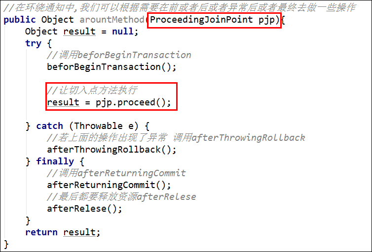

# Spring03

## 内容介绍

1.代码优化,使用动态代理(提高代码的复用性,不修改原来代码的基础上可以动态的添加上事务操作.)

**2.spring中AOP(面向切面编程,底层使用的就是动态代理技术)**

* xml方式
* **==xml+注解方式==**
* 纯注解

3.将转账案例代码进行优化,使用aop技术(理解)

4.JDBCTemplate(spring提供的dao层的框架,和DBUtils操作差不多)


# 转账案例优化

存在的问题:

1. 不但转账方法需要添加事务管理,其他的操作也需要添加事务.---==代码重复==
2. 业务的代码和事务的代码耦合了

解决方案:

* 我们可以通过动态代理的方式，对所有业务方法进行事务的增强。这样就不会对业务层产生影响，解决了耦合性的问题和代码复用的问题，让程序员只关心核心业务

## 常用的动态代理技术


### jdk动态代理(理解)

```java
interface UserService {
    void save();
}

class UserServiceImpl implements UserService {
    public void save() {
        System.out.println("执行了UserServiceImpl中的save方法");
    }
}

public class TestJDKProxy {
    private <T> T createProxyForJDK(Class<T> clazz) {
        try {
            T t = clazz.newInstance();
            return (T) Proxy.newProxyInstance(clazz.getClassLoader(), clazz.getInterfaces(), new InvocationHandler() {
                @Override
                public Object invoke(Object proxy, Method method, Object[] args) throws Throwable {
                    Object result = null;

                    try {
                        System.out.println("开启事务");
                        result = method.invoke(t, args);
                    } catch (Exception e) {
                        e.printStackTrace();
                        System.out.println("回滚事务");
                    } finally {
                        System.out.println("提交事务");
                    }

                    return result;
                }
            });
        } catch (Exception e) {
            e.printStackTrace();
        }
        return null;
    }

    @Test
    public void testJDKProxy() {
        UserService userService = createProxyForJDK(UserServiceImpl.class);
        userService.save();
    }
}
```


### CGLIB代理(理解)

使用的时候就需要导入cglib的jar包(spring内置了)

```java
public class TestCGLIBProxy {

    private <T> T createCGLIBProxy(Class<T> clazz) {
        try {
            return (T) Enhancer.create(clazz, new MethodInterceptor() {
                public Object intercept(Object o, Method method, Object[] objects, MethodProxy methodProxy) throws Throwable {
                    Object result = null;

                    try {

                        System.out.println("开启事务");

                        result = methodProxy.invokeSuper(o, objects); // 调用原有业务
                    } catch (Exception e) {
                        e.printStackTrace();

                        System.out.println("回滚事务");
                    } finally {
                        System.out.println("提交事务");
                    }

                    return result;
                }
            });
        } catch (Exception e) {
            e.printStackTrace();
        }

        return null;
    }

    @Test
    public void testCGLIBProxy() {
        // 当对一个普通的类：没有接口实现时，需要使用CGLIB来创建代理类
        StudentService studentService = createCGLIBProxy(StudentService.class);
        studentService.save();
    }
}

class StudentService {
    public void save() {
        System.out.println("执行了StudentService中的save方法");
    }
}
```


### 面试题


1、静态代理和动态代理有什么区别？

2、动态代理有几种实现技术？区别在哪里？


## 使用动态代理优化转账案例

需求: 使用动态代理技术，优化service层的代码，即使用代理类来处理事务

步骤分析:

1. 复制spring02_dbutils工程，改名为spring03_02_dbutils_proxy

2. 创建一个产生AccountServiceImpl代理对象工厂, 提供一个创建代理对象的方法

   - 在类上添加@Component注解
   - 注入AccountService和事务管理器TransactionManager

   - 添加一个方法，返回代理对象，并在方法上添加@Bean注解，将代理类交给Spring管理

3. 测试的时候注入代理对象

代码实现:

* 删除AccountService中的事务控制代码

```java
@Service
public class AccountServiceImpl implements AccountService {

    @Autowired
    private AccountDao accountDao;

    @Override
    public void transfer(String from, String to, int money) {
        accountDao.updateMoney(from, -money);
        //System.out.println(1 / 0);
        accountDao.updateMoney(to, money);
    }
}
```


- JDBCUtils

```java
@Component
public class JDBCUtils {
    // ThreadLocal 特性：可以保证在同一个线程中，对象唯一
    // ThreadLocal 是一个容器，容器特点：可以存取对象
    private static final ThreadLocal<Connection> TL = new ThreadLocal<>();

    @Resource
    private DataSource dataSource;

    public Connection getConnection() {
        Connection connection = null;
        try {
            connection = TL.get();
            // 当前线程第1次调用该方法
            if (connection == null) {
                connection = dataSource.getConnection();
                TL.set(connection);
            }
        } catch (SQLException e) {
            e.printStackTrace();
        }
        System.out.println(connection);
        return connection;
    }

    public void close(Connection conn) {
        if (conn != null) {
            try {
                conn.close();
                TL.remove();
            } catch (SQLException e) {
                e.printStackTrace();
            }
        }
    }
}
```


* 编写一个创建AccountService代理对象的工厂类

```java
@Component
public class ProxyUtils {
    @Resource
    private JDBCUtils jdbcUtils;

    public <T>T getProxy(Object o) {
        try {
            return (T)Proxy.newProxyInstance(
                    o.getClass().getClassLoader(),
                    o.getClass().getInterfaces(),
                    (proxy, method, args) -> {
                        Object result = null;
                        Connection conn = null;
                        try {
                            conn = jdbcUtils.getConnection();
                            conn.setAutoCommit(false);
                            result = method.invoke(o, args);
                        } catch (Exception e) {
                            e.printStackTrace();
                            try {
                                conn.rollback();
                            } catch (SQLException e1) {
                                e1.printStackTrace();
                            }
                        } finally {
                            try {
                                conn.commit();
                                jdbcUtils.close(conn);
                            } catch (SQLException e) {
                                e.printStackTrace();
                            }
                        }
                        return result;
                    });
        } catch (Exception e) {
            e.printStackTrace();
        }
        return null;
    }
}
```

*  编写测试类,注入service的代理对象

```java
@ContextConfiguration("classpath:applicationContext.xml")
@RunWith(SpringJUnit4ClassRunner.class)
public class Tester {
    @Resource
    private AccountService accountService;

    @Resource
    private ProxyUtils proxyUtils;

    @Test
    public void test01() {
        AccountService proxy = proxyUtils.getProxy(accountService);
        proxy.transfer("tom", "jack", 100);
    }
}
```


## 动态代理的更高级应用(理解)


在只有接口，没有实现类的情况下创建代理类，实现==偷梁换柱==！看懂了能更好的理解MyBatis，看不懂没关系！

### OrderDao.java

```java
public interface OrderDao {
    @SQL("select * from orders where id=?")
    Orders get(int id);

    @SQL("select * from orders")
    List<Orders> getAll();
}
```


### SQL注解

```java
@Target(ElementType.METHOD)
@Retention(RetentionPolicy.RUNTIME)
public @interface SQL {
    String value();
}
```


### 订单表数据


### 实体类Orders

```java
public class Orders {
    private int id;
    private String name;

    public int getId() {
        return id;
    }

    public void setId(int id) {
        this.id = id;
    }

    public String getName() {
        return name;
    }

    public void setName(String name) {
        this.name = name;
    }

    @Override
    public String toString() {
        return "Orders{" +
                "id=" + id +
                ", name='" + name + '\'' +
                '}';
    }
}
```


### 测试类

```java
@ContextConfiguration("classpath:applicationContext.xml")
@RunWith(SpringJUnit4ClassRunner.class)
public class Tester {

    @Resource
    private ProxyUtils proxyUtils;

    @Test
    public void test01() {
        OrderDao orderDao = proxyUtils.getProxy(OrderDao.class);
        Orders orders = orderDao.get(1);
        System.out.println(orders);
        List<Orders> list = orderDao.getAll();
        System.out.println(list);
    }
}
```


### ProxyUtils

```java
@Component
public class ProxyUtils {
    @Resource
    private JDBCUtils jdbcUtils;

    @Resource
    private QueryRunner qr;

    public <T> T getProxy(Class<T> clazz) {
        return (T) Proxy.newProxyInstance(
                clazz.getClassLoader(),
                new Class[]{clazz},
                (proxy, method, args) -> {
                    String sql = method.getAnnotation(SQL.class).value();
                    Class<?> returnType = method.getReturnType();
                    if (returnType == List.class) {
                        // 获取List中的泛型类型
                        Type type = method.getGenericReturnType();
                        ParameterizedType pt = (ParameterizedType)type;
                        // genericClazz: Class<Orders>
                        Class genericClazz = (Class) pt.getActualTypeArguments()[0];
                        return qr.query(sql, new BeanListHandler<>(genericClazz), args);
                    } else {
                        return qr.query(sql, new BeanHandler<>(returnType), args);
                    }
                });
    }
}
```


# SpringAOP简介

AOP（Aspect Oriented Programming）：面向==切面(方面)==编程，他不是一种技术而是一种思想，解决：在不破坏源代码的情况下，实现对业务方法的增强.可以减少重复代码,提高代码重用性,让我们开发者只关心核心业务逻辑的代码

AOP是面向对象编程OOP（Object Oriented Programming）的补充！是一个里程碑式的进步！

常见的应用场景:

* **==事务管理==**
* 日志处理
* 性能测试
* ...

aop思想底层实现技术：JDK动态代理、CGLIB，根据是否有接口选择使用其中一种技术.

**相关术语**

```markdown
* target：代理的目标对象，即被代理类
* proxy：代理类
* pointcut：切入点，需要被增强的方法
* joinPoint：连接点，被拦截到的方法，类似动态代理中的Method，用于执行原有业务
* advice：通知，为被代理类提供增强的对象
* aspect：切面， 切点+通知(声明对那些方法在什么时候执行哪些操作)
* weaving：织入，是指把增强应用到目标对象来创建出代理对象的过程
```


# 基于纯XML的AOP开发

## 快速入门

需求:在执行某个service中save方法之前,执行通知类（提供增强的类）中的beginTransaction方法

步骤:

* 新建一个项目,==导入jar包==
  * spring-context
  
  * spring-aop(导入spring-context已经导入了)
  
  * spring-aspects (spring整合了Aspectj，是对SpringAOP的补充)
  
      
  
  * spring-test
  
  * junit
* 编写一个AccountService,在service中编写save方法,编写实现类
* 编写一个通知类(TransactionManager), 在此类中编写一个beginTransaction方法
* 使用xml进行配置
  * 配置service,交给spring容器管理
  * 配置通知类,交给spring容器管理
  * ==aop配置==
    * 配置切面
    * ==配置通知: 在切入点执行的什么时候 执行哪个类中的哪个方法==


## 切点表达式

```markdown
execution([修饰符] 返回值 包名.类名.方法名(参数类型列表))
例:
execution(void com.bjpowernode.service.impl.AccountServiceImpl.transfer(String,String,int))
提示: 表达式中可以使用 * 和 ..
	*	通配符,任意匹配
	..   
		在包名位置:当前包及其子包下
		在方法的括号中:参数任意
```

例如:

* void com.bjpowernode.service.impl.UserServiceImpl.save(User) :

  com.bjpowernode.service.impl.UserServiceImpl类中的参数类型为User的save方法，没有有返回值，访问修饰符任意

* \* com.bjpowernode.service.impl.UserServiceImpl.*()  :  

  com.bjpowernode.service.impl.UserServiceImpl类下的所有无参方法，返回值任意，修饰符任意

* \* com.bjpowernode.service.impl.UserServiceImpl.*(..) :   

  com.bjpowernode.service.impl.UserServiceImpl类下的所有方法，返回值任意，修饰符任意

* \* com.bjpowernode.service.impl.\*.\*(..) : 

  com.bjpowernode.service.impl包下的任意类中的任意方法，返回值任意，修饰符任意

* \* com.bjpowernode.service..*.\*(..)  : 

  com.bjpowernode.service包及其子包下的所有类中的所有方法，返回值任意，修饰符任意

* \* com.bjpowernode.service..*.find\*(..) : 

  com.bjpowernode.service包及其子包下的任意类中的以find开头的所有方法，返回值任意，修饰符任意

* **\*  \*..service..\*.\*(..)**   

  所有包下的service包及其子包下的所有类中的所有方法，返回值任意，修饰符任意


代码实现


```xml
<!-- Service: target：需要被增强的类 -->
<bean id="accountService" class="com.bjpowernode.service.impl.AccountServiceImpl" />

<!--配置通知：对目标对象提供增强的类-->
<bean id="transactionManager" class="com.bjpowernode.utils.TransactionManager" />

<aop:config>
    <!--配置切面，指定使用哪个通知类进行增强-->
    <aop:aspect ref="transactionManager">
        <!--
            前置通知：在原有业务执行之前执行
            method：通知中提供增强的方法
            pointcut：指定哪些方法应用这个前置通知
        -->
        <!--<aop:before method="beginTransaction"
                    pointcut="execution(public void com.bjpowernode.service.impl.AccountServiceImpl.save())" />
        <aop:before method="beginTransaction"
                    pointcut="execution(public void com.bjpowernode.service.impl.AccountServiceImpl.transfer(String,String,int))" />-->
        <aop:before method="beginTransaction"
                    pointcut="execution(public void com.bjpowernode.service.impl.AccountServiceImpl.*(..))" />
    </aop:aspect>
</aop:config>
```

## 通知类型

5种:

* before: 前置通知 在切入点（目标方法）执行之前执行
* after-returning :后置通知 在切入点（目标方法）执行之后执行
* after-throwing:  异常通知 在切入点（目标方法）发生异常之后执行
* after: 最终通知 无论如何都会执行的代码
* **==around==**:环绕通知, 以上四个通知的组合

注意:**==后置通知和异常通知不会同时出现==**.

**==开发中一般使用的都是环绕通知.==**


## 抽取切入点

```xml
<!--aop配置-->
<aop:config>
    <!--抽取了切入点表达式-->
    <aop:pointcut id="pc_save" expression="execution(public void com.bjpowernode.service.impl.AccountServiceImpl.save())"/>

    <!--配置切面:在切入点执行的什么时候 执行哪个类中的哪个方法-->
    <aop:aspect ref="transactionManager">
        <!--前置通知-->
        <aop:before method="beforBeginTransaction"  		pointcut-ref="pc_save"/>
        <aop:after-returning method="afterReturningCommit" 	pointcut-ref="pc_save"/>
        <aop:after-throwing method="afterThrowingRollback" 	pointcut-ref="pc_save"/>
        <aop:after method="afterRelese" 					pointcut-ref="pc_save"/>
    </aop:aspect>
</aop:config>
```


## 环绕通知




```xml
<?xml version="1.0" encoding="UTF-8"?>
<beans xmlns="http://www.springframework.org/schema/beans"
       xmlns:xsi="http://www.w3.org/2001/XMLSchema-instance"
       xmlns:aop="http://www.springframework.org/schema/aop"
       xsi:schemaLocation="http://www.springframework.org/schema/beans
       http://www.springframework.org/schema/beans/spring-beans.xsd
       http://www.springframework.org/schema/aop
       https://www.springframework.org/schema/aop/spring-aop.xsd">
<!-- Service: target：需要被增强的类 -->
<bean id="accountService" class="com.bjpowernode.service.impl.AccountServiceImpl" />

<!--配置通知：对目标对象提供增强的类-->
<bean id="transactionManager" class="com.bjpowernode.utils.TransactionManager" />

<aop:config>

    <!--配置切入点-->
    <aop:pointcut id="pc_save" expression="execution(public void com.bjpowernode.service.impl.AccountServiceImpl.save())" />

    <!--配置切面，指定使用哪个通知类进行增强-->
    <aop:aspect ref="transactionManager">
        <!--
            前置通知：在原有业务执行之前执行
            method：通知中提供增强的方法
            pointcut：指定哪些方法应用这个前置通知
        -->
        <!--<aop:before method="beginTransaction"
                    pointcut="execution(public void com.bjpowernode.service.impl.AccountServiceImpl.save())" />
        <aop:before method="beginTransaction"
                    pointcut="execution(public void com.bjpowernode.service.impl.AccountServiceImpl.transfer(String,String,int))" />-->
        <!--<aop:before method="beginTransaction"-->
                    <!--pointcut="execution(public void com.bjpowernode.service.impl.AccountServiceImpl.*(..))" />-->

        <!--切入点的抽取-->
        <!--<aop:before method="beginTransaction"           pointcut-ref="pc_save" />-->
        <!--<aop:after-returning method="afterReturning"    pointcut-ref="pc_save" />-->
        <!--<aop:after-throwing method="afterThrowing"      pointcut-ref="pc_save" />-->
        <!--<aop:after method="after"                       pointcut-ref="pc_save" />-->

        <!--环绕通知-->
        <aop:around method="aroundMethod" pointcut="execution(* com.bjpowernode.service..*.*(..))" />
    </aop:aspect>
</aop:config>
</beans>
```


# 基于注解的AOP开发

## 快速入门(注解+XML)

需求:在执行某个service中方法的时候,添加**==环绕通知==**

步骤分析:

1. 复制spring03_aop_xml工程,重命名为spring03_aop_xml_anno
2. 使用注解将accountservice和通知类交给spring容器管理
3. 使用**注解**配置切面
4. 在xml中
   - 开启组件扫描
   - 开启aop的自动代理支持
5. 在通知类上添加一个注解@Aspect 声明他是一个通知类

**代码实现**:


通知类的代码:

```java
@Component
@Aspect  //声明他是一个注解通知类
public class TransactionManager {

    //@Before("execution(* com.bjpowernode.service..*.save(..))")
    public void beforBeginTransaction(){
        System.out.println("开启了事务");
    }

    public void afterReturningCommit(){
        System.out.println("提交了事务");
    }

    public void afterThrowingRollback(){
        System.out.println("回滚了事务");
    }


    public void afterRelese(){
        System.out.println("释放资源");
    }

    //在环绕通知中,我们可以根据需要在前或者后或者异常后或者最终去做一些操作
    @Around("execution(* com.bjpowernode.service..*.save(..))")
    public Object arountMethod(ProceedingJoinPoint pjp){
        Object result = null;
        try {
            //调用beforBeginTransaction
            beforBeginTransaction();

            //让切入点方法执行
            result = pjp.proceed();
            
        } catch (Throwable e) {
            //若上面的操作出现了异常 调用afterThrowingRollback
            afterThrowingRollback();
        } finally {
            //调用afterReturningCommit
            afterReturningCommit();
            //最后都要释放资源afterRelese
            afterRelese();
        }
        return result;
    }
}

```


applicationContext.xml

```xml
<!--开启组件扫描-->
<context:component-scan base-package="com.bjpowernode"/>

<!--开启aop注解支持-->
<aop:aspectj-autoproxy />
```


## 抽取切入点

1. 编写一个方法,方法名称任意,返回值为void,在方法上使用@Pointcut注解声明切入点表达式
2. 在通知注解的value属性上填写"切入点表达式坐在的方法名()"即可 

```java
@Component
@Aspect  //声明他是一个注解通知类
public class TransactionManager {

    //抽取切入点表达式
    @Pointcut("execution(* com.bjpowernode.service..*.save(..))")
    private void pc_save(){}

    //在环绕通知中,我们可以根据需要在前或者后或者异常后或者最终去做一些操作
    //@Around("execution(* com.bjpowernode.service..*.save(..))")
    @Around("pc_save()")
    public Object arountMethod(ProceedingJoinPoint pjp){
        Object result = null;
        try {
            //调用beforBeginTransaction
            beforBeginTransaction();

            //让切入点方法执行
            result = pjp.proceed();
        } catch (Throwable e) {
            //若上面的操作出现了异常 调用afterThrowingRollback
            afterThrowingRollback();
        } finally {
            //调用afterReturningCommit
            afterReturningCommit();
            //最后都要释放资源afterRelese
            afterRelese();
        }
        return result;
    }
}

```


## 纯注解（了解）

1. 复制spring03_aop_xml_anno 改名为spring03_aop_anno
2. 声明一个配置类
   - 组件扫描的注解
   - aop自动代理可用的注解(开启aop注解支持)

```java
@Configuration //声明自己是一个配置类
@ComponentScan("com.bjpowernode")
@EnableAspectJAutoProxy //开启aop注解支持
public class SpringConfig {
}
```

3.修改测试类, 因为我们使用了注解方式


# 使用AOP优化转账案例（自己敲）

使用xml方式优化

1. 复制spring02_dbutils,改名为spring03_06_dbutils_xml_anno
2. 添加 spring-aspect依赖
3. 把AccountServiceImpl中的事务控制去掉，只保留核心业务
4. 把JDBCUtils改名为在TransactionManager
   - 在TransactionManager类上添加了==@Aspect==注解，表面当前是一个通知类
   - 在TransactionManager类中添加环绕通知的方法，并在方法上添加==@Around==注解
   - 在@Around上添加切入点表达式@Around(execution(* com.bjpowernode.service..*.*(..)))
5. 在applicationContext.xml中开启自动代理


TransactionManager.java

```java
@Component
@Aspect // 标注当前是通知类（提供增强的类）
public class TransactionManager {
    @Autowired
    private DataSource dataSource;
    // ThreadLocal和当前线程相关的对象，可以将对象绑定到线程上，在同一个线程中，获取到的始终是同一个对象
    private static ThreadLocal<Connection> TL = new ThreadLocal<>();

    public Connection getConnection() {
        Connection conn = null;
        try {
            conn = TL.get(); // 从线程上获取连接对象
            if ( conn == null ) {
                // 当前线程第一次调用getConnection方法
                conn = dataSource.getConnection();
                // 将连接对象和线程进行绑定
                TL.set(conn);
            }
        } catch (SQLException e) {
            e.printStackTrace();
        }
        //System.out.println(conn);
        return conn;
    }


    public void begin() {
        try {
            getConnection().setAutoCommit(false);
        } catch (SQLException e) {
            e.printStackTrace();
        }
    }

    public void rollback() {
        try {
            getConnection().rollback();
        } catch (SQLException e) {
            e.printStackTrace();
        }
    }

    public void commit() {
        try {
            getConnection().commit();
        } catch (SQLException e) {
            e.printStackTrace();
        }
    }

    public void release() {
        try {
            // 不是真正的关闭，而是将连接对象返回给连接池，底层是动态代理技术
            getConnection().close();
            // 将连接对象从当前线程移除
            TL.remove();
        } catch (SQLException e) {
            e.printStackTrace();
        }
    }

    // pjp理解为动态代理中的invoke方法中Method，用于执行原有业务
    @Around("execution(* com.bjpowernode.service..*.*(..))")
    public Object aroundMethod(ProceedingJoinPoint pjp) {
        Object result = null;
        try {

            begin(); // 开启事务
            result = pjp.proceed();// 执行原有业务

        } catch (Throwable e) {
            e.printStackTrace();
            // 回滚事务
            rollback();
        } finally {
            // 提交事务
            commit();
            release();
        }
        return result;
    }
}
```

在applicationContext.xml中开启自动代理


# Spring的JdbcTemplate

类似于DBUtils，也是对JDBC的简单封装，简化DAO层的开发

```
// Ctrl + Alt + O 优化包导入
// Ctrl + Alt + L 格式化代码
```


## JdbcTemplate概述

JdbcTemplate是Spring中的一款工作在Dao层的轻量级框架.

它的使用与DBUtils类似

**核心对象**

`new JdbcTemplate(DataSource ds)`

**核心方法**

| 方法名                                                       | 作用                                                    |
| ------------------------------------------------------------ | ------------------------------------------------------- |
| int update(String sql,Object...args)                         | 主要执行DML中cud操作                                    |
| T queryForObject(String sql,Class\<T> clazz,Object..args)    | 将查询的唯一结果封装成指定的对象                        |
| List\<T> query(String sql,RowMapper\<T> mapper,Object...args) | 将查询的每条记录封装成指定的对象,将所有的对象放入list中 |

若查询的记录需要封装一个指定的javabean,使用RowMapper的一个实现类即可

==BeanPropertyRowMapper==


## Spring整合JdbcTemplate

步骤分析:

1. 新建一个项目,导入依赖

   - spring-context 
   - spring-test、junit
   - mysql、druid
   - ==**spring-jdbc**==

2. 添加jdbc.properties配置文件

3. 创建applicationContext.xml

   - 开启组件扫描

   - 引入jdbc.properties
   - 配置数据源
   - 配置JdbcTemplate
     - 使用构造函数注入数据源  // new Template(DataSource ds)

4. 编写测试类

   - 编写sql语句
   - 调用jdbcTemplate的update方法执行sql语句


### applicationContext.xml

```xml
<?xml version="1.0" encoding="UTF-8"?>
<beans xmlns="http://www.springframework.org/schema/beans"
       xmlns:xsi="http://www.w3.org/2001/XMLSchema-instance"
       xmlns:context="http://www.springframework.org/schema/context"
       xsi:schemaLocation="http://www.springframework.org/schema/beans http://www.springframework.org/schema/beans/spring-beans.xsd http://www.springframework.org/schema/context https://www.springframework.org/schema/context/spring-context.xsd">

    <!--开启组件扫描-->
    <context:component-scan base-package="com.bjpowernode"/>

    <!--配置数据源-->
    <!--导入jdbc.properties-->
    <context:property-placeholder location="classpath:jdbc.properties"/>
    <bean id="dataSource" class="com.alibaba.druid.pool.DruidDataSource">
        <property name="driverClassName" value="${jdbc.driver}" />
        <property name="url" value="${jdbc.url}" />
        <property name="username" value="${jdbc.username}" />
        <property name="password" value="${jdbc.password}" />
    </bean>

    <!--配置JdbcTemplate-->
    <bean id="jdbcTemplate" class="org.springframework.jdbc.core.JdbcTemplate">
        <constructor-arg name="dataSource" ref="dataSource" />
    </bean>
</beans>
```


```java
@ContextConfiguration("classpath:applicationContext.xml")
@RunWith(SpringJUnit4ClassRunner.class)
public class TestJDBCTemplate {
    @Resource
    private JdbcTemplate jdbcTemplate;

    @Test
    public void testInsert() {
        String sql = "insert into account values(null, ?,?)";
        jdbcTemplate.update(sql, "zhangsan", 1000);
    }

    @Test
    public void testDelete() {
        String sql = "delete from account where id=?";
        jdbcTemplate.update(sql, 3);
    }

    @Test
    public void testQueryObject() {
        String sql = "select * from account where id=?";
        Account account = jdbcTemplate.queryForObject(sql, new BeanPropertyRowMapper<>(Account.class), 1);
        System.out.println(account);
    }

    @Test
    public void testQueryList() {
        String sql = "select * from account";
        List<Account> aList = jdbcTemplate.query(sql, new BeanPropertyRowMapper<>(Account.class));
        System.out.println(aList);
    }
}
```


### AccoountDao

```java
@Repository
public class AccountDaoImpl implements AccountDao {

    @Resource
    private JdbcTemplate jdbcTemplate;

    @Override
    public int insert(Account account) {
        String sql = "insert into account values(null, ?,?)";
        return jdbcTemplate.update(sql, account.getName(), account.getMoney());
    }
}
```


