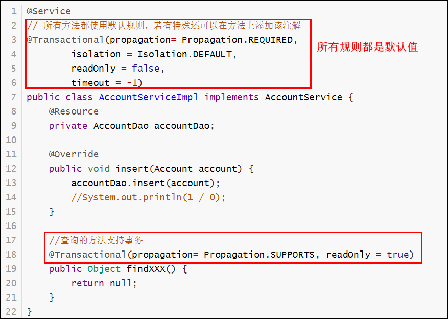

# Spring04

# Spring的事务控制

## 事务控制方式

### 编程式事务控制

开发者直接把事务的代码和业务代码耦合到一起，在实际开发中不用。

### 声明式事务控制

开发者采用**配置的方式**来实现的事务控制，业务代码与事务代码实现解耦合，使用的是AOP思想。


## 相关接口和实现类

### PlatformTransactionManager(重点)

PlatformTransactionManager（平台事务管理器）接口中提供了我们常用的操作事务的方法。

| 方法                                                         | 说明               |
| ------------------------------------------------------------ | ------------------ |
| TransactionStatus getTransaction(TransactionDefinition definition); | 获取事务的状态信息 |
| void commit(TransactionStatus status);                       | 提交事务           |
| void rollback(TransactionStatus status);                     | 回滚事务           |


根据不同的持久层（DAO）技术对该接口提供了不同的实现：

```markdown
* DataSourceTransactionManager
		jdbc 和 mybatis
* HibernateTransactionManager(导入spring-orm)
		hibernate 
* JpaTransactionManager(导入spring-orm)
		jpa(spring data)
```


### TransactionDefinition（了解）

TransactionDefinition（事务的定义）接口提供了事务相关的定义，如事务隔离级别、事务传播行为等等

| 方法                         | 说明               |
| ---------------------------- | ------------------ |
| int getIsolationLevel()      | 获得事务的隔离级别 |
| int getPropogationBehavior() | 获得事务的传播行为 |
| int getTimeout()             | 获得超时时间       |
| boolean isReadOnly()         | 是否只读           |


其实现类中提供了这些事务定义的==set==方法

| 方法                                                 | 说明               |
| ---------------------------------------------------- | ------------------ |
| void setIsolationLevel(int isolationLevel)           | 设置事务的隔离级别 |
| void setPropogationBehavior(int propagationBehavior) | 设置事务的传播行为 |
| void setTimeout(int timeout)                         | 设置超时时间       |
| void setReadOnly(boolean readOnly)                   | 是否只读           |


**事务的隔离级别**

```markdown
* TransactionDefinition.ISOLATION_DEFAULT 
		数据库默认级别
		
* TransactionDefinition.ISOLATION_READ_UNCOMMITTED 
		read_uncommitted：读未提交【会出现脏读、不可重复读、幻读问题】
		
* TransactionDefinition.ISOLATION_READ_COMMITTED
		read_committed：读已提交【会出现不可重复读、幻读问题】 Oracle默认
		不可重复读：在一个事务中，针对某一条记录,两次查询的效果不一致.针对的更新操作
		
* TransactionDefinition.ISOLATION_REPEATABLE_READ 
		repeatable_read：可重复读【会出现幻读问题】	MySQL默认
		幻读：在一个事务中，两次查询的统计数据不一致.针对的是添加和删除操作
		
* TransactionDefinition.ISOLATION_SERIALIZABLE 
		serializable：串行化【能够避免所有问题，相当于锁表】
```


**事务的传播行为**


传播行为规定在一个业务方法中，调用另外一个业务方法，事务该如何处理？


public void A() { // A业务

​	B(); // 在A业务中调用B业务

}

**REQUIRED**：如果A没有事务，则新建事务，B在A的事务中进行处理，如果A有事务，则B在A的事务中运行

**SUPPORTS**：支持当前事务，如果A没有事务，则B就以非事务的方式运行，如果有事务，则在A的事务中运行

| 传播行为      | 说明                                                         |
| ------------- | ------------------------------------------------------------ |
| **REQUIRED**  | 如果当前没有事务，就新建一个事务，如果已经存在一个事务中，加入到这个事务中。 一般的选择（默认值） |
| **SUPPORTS**  | 支持当前事务，如果当前没有事务，就以非事务方式执行           |
| MANDATORY     | 使用当前的事务，如果当前没有事务，就抛出异常                 |
| REQUERS_NEW   | 新建事务，如果当前在事务中，把当前事务挂起                   |
| NOT_SUPPORTED | 以非事务方式执行操作，如果当前存在事务，就把当前事务挂起     |
| NEVER         | 以非事务方式运行，如果当前存在事务，抛出异常                 |
| NESTED        | 如果当前存在事务，则在嵌套事务内执行。如果当前没有事务，则执行 REQUIRED 类似 的操作 |


**只读和超时时间**

```markdown
* read-only（是否只读）：建议查询时设置为只读
* timeout（超时时间）：默认值是-1，没有超时限制。如果有，以秒为单位进行设置
```


### TransactionStatus（了解）

TransactionStatus （事务的状态）接口提供了事务具体的运行状态。

| 方法                       | 说明         |
| -------------------------- | ------------ |
| boolean isNewTransaction() | 是否是新事务 |
| boolean hasSavepoint()     | 是否有回滚点 |
| boolean isRollbackOnly()   | 事务是否回滚 |
| boolean isCompleted()      | 事务是否完成 |


## 编程式事务【了解】

开发者直接把事务的代码和业务代码耦合到一起，在实际开发中不用。

#### XML + 事务管理器的API

步骤：

1. 复制昨天的工程spring03_07_jdbctemplate，改名为spring04_01_transaction_programming_xml_api
2. 在applicationContext.xml中配置事务管理器

3. 添加AccountService及其实现类AccountServiceImpl
    - 在类上添加@Service注解
    - 注入AccountDao
    - 注入事务管理器
4. 在AccountServiceImpl中使用事务管理器进行事务管理
5. 编写测试类


applicationContext.xml：添加了事务管理器

```xml
<!--开启组件扫描-->
<context:component-scan base-package="com.bjpowernode"/>
<!--导入jdbc.properties-->
<context:property-placeholder location="classpath:jdbc.properties"/>
<!--配置数据源-->
<bean id="dataSource" class="com.alibaba.druid.pool.DruidDataSource">
    <property name="driverClassName" value="${jdbc.driver}"/>
    <property name="url" value="${jdbc.url}"/>
    <property name="username" value="${jdbc.username}"/>
    <property name="password" value="${jdbc.password}"/>
</bean>

<!--配置JdbcTemplate-->
<bean id="jdbcTemplate" class="org.springframework.jdbc.core.JdbcTemplate">
    <constructor-arg name="dataSource" ref="dataSource"/>
</bean>

<!--配置事务管理器-->
<bean id="transactionManager" class="org.springframework.jdbc.datasource.DataSourceTransactionManager">
    <property name="dataSource" ref="dataSource"/>
</bean>
```


AccountServiceImpl

```java
@Service
public class AccountServiceImpl implements AccountService {
    @Resource
    private AccountDao accountDao;

    @Resource
    private PlatformTransactionManager transactionManager;

    @Override
    public void insert(Account account) {
        // 创建事务定义对象
        TransactionTemplate def = new TransactionTemplate();
        // 设置是否只读， false支持事务
        def.setReadOnly(false);
        // 设置事务隔离级别，一般使用默认级别
        def.setIsolationLevel(TransactionDefinition.ISOLATION_DEFAULT);
        // 设置事务传播行为，必须有事务
        def.setPropagationBehavior(TransactionDefinition.PROPAGATION_REQUIRED);
        // 设置事务的超时时间，默认是-1，永不超时
        def.setTimeout(-1);
        // 获取事务状态，回滚和提交事务时，会对该状态进行设置
        TransactionStatus status = transactionManager.getTransaction(def);
        try {
            accountDao.insert(account);
            //System.out.println(1 / 0);
        } catch (Throwable e) {
            e.printStackTrace();
            // 回滚事务
            transactionManager.rollback(status);
        } finally {
            // 提交事务
            transactionManager.commit(status);
        }
    }
}
```


测试类

```java
@ContextConfiguration("classpath:applicationContext.xml")
@RunWith(SpringJUnit4ClassRunner.class)
public class TestJDBCTemplate {

    @Resource
    private AccountService accountService;

    @Test
    public void testService() {
        Account account = new Account();
        account.setName("张三");
        account.setMoney(5000);
        accountService.insert(account);
    }
}
```


#### XML + 注解

步骤

1. 复制工程spring04_01_transaction_programming_xml_api，

    改名为spring04_02_transaction_programming_xml_anno

2. 在applicationContext.xml添加事务的注解支持

3. AccountServiceImpl中仅保留核心业务
    - 在类上添加@Transactional注解，service中的所有方法都使用默认的事务控制
    - 在特殊方法上添加@Transactional注解覆盖全局配置
4. 测试


applicationContext.xml

```xml
<!--开启组件扫描-->
<context:component-scan base-package="com.bjpowernode"/>

<!--配置数据源-->
<!--导入jdbc.properties-->
<context:property-placeholder location="classpath:jdbc.properties"/>
<bean id="dataSource" class="com.alibaba.druid.pool.DruidDataSource">
    <property name="driverClassName" value="${jdbc.driver}" />
    <property name="url" value="${jdbc.url}" />
    <property name="username" value="${jdbc.username}" />
    <property name="password" value="${jdbc.password}" />
</bean>

<!--配置JdbcTemplate-->
<bean id="jdbcTemplate" class="org.springframework.jdbc.core.JdbcTemplate">
    <constructor-arg name="dataSource" ref="dataSource" />
</bean>

<!--配置事务管理器-->
<bean id="transactionManager" class="org.springframework.jdbc.datasource.DataSourceTransactionManager">
    <property name="dataSource" ref="dataSource" />
</bean>

<!--事务的注解支持-->
<tx:annotation-driven/>
```


AccountServiceImpl

```java
@Service
// 所有方法都使用默认规则，若有特殊还可以在方法上添加该注解
@Transactional(propagation= Propagation.REQUIRED,
        isolation = Isolation.DEFAULT,
        readOnly = false,
        timeout = -1)
public class AccountServiceImpl implements AccountService {
    @Resource
    private AccountDao accountDao;

    @Override
    public void insert(Account account) {
        accountDao.insert(account);
        //System.out.println(1 / 0);
    }

    //查询的方法支持事务，只读
    @Transactional(propagation= Propagation.SUPPORTS, readOnly = true)
    public Object findXXX() {
        return null;
    }
}
```




## 声明式事务【重点】

开发者采用**配置的方式**来实现的事务控制，业务代码与事务代码实现解耦合，使用的AOP思想。

底层对象使用的还是编程式事务对象


### xml+自定义通知（xml）(了解)


1. 复制工程spring04_02_transaction_programming_xml_anno，

    改名为spring04_03_transaction_declarative_xml_myadvice_xml

2. 导入spring-aspects依赖

3. AccountServiceImpl中仅保留核心业务

4. 定义通知类（增强），并添加环绕通知的方法aroundMethod

5. 在通知类中使用事务管理器API对事务进行控制

6. 在applicationContext.xml中

    - 配置通知

    - 添加AOP配置

7. 测试


通知类MyAdvice

```java
public class MyAdvice {
    private PlatformTransactionManager transactionManager;

    public void setTransactionManager(PlatformTransactionManager transactionManager) {
        this.transactionManager = transactionManager;
    }

    public <T> T aroundMethod(ProceedingJoinPoint pjp) {

        T t = null;

        // 创建事务定义对象
        TransactionTemplate def = new TransactionTemplate();
        // 设置是否只读， false支持事务
        def.setReadOnly(false);
        // 设置事务隔离级别，一般使用默认级别
        def.setIsolationLevel(TransactionDefinition.ISOLATION_DEFAULT);
        // 设置事务传播行为，必须有事务
        def.setPropagationBehavior(TransactionDefinition.PROPAGATION_REQUIRED);
        // 设置事务的超时时间，默认是-1，永不超时
        def.setTimeout(-1);
        // 获取事务状态，回滚和提交事务时，会对该状态进行设置
        TransactionStatus status = transactionManager.getTransaction(def);
        try {
            t = (T)pjp.proceed();
            //System.out.println(1 / 0);
        } catch (Throwable e) {
            e.printStackTrace();
            // 回滚事务
            transactionManager.rollback(status);
        } finally {
            // 提交事务
            transactionManager.commit(status);
        }
        return t;
    }
}
```


applicationContext.xml

```xml
<!--开启组件扫描-->
<context:component-scan base-package="com.bjpowernode"/>

<!--配置数据源-->
<!--导入jdbc.properties-->
<context:property-placeholder location="classpath:jdbc.properties"/>
<bean id="dataSource" class="com.alibaba.druid.pool.DruidDataSource">
    <property name="driverClassName" value="${jdbc.driver}" />
    <property name="url" value="${jdbc.url}" />
    <property name="username" value="${jdbc.username}" />
    <property name="password" value="${jdbc.password}" />
</bean>

<!--配置JdbcTemplate-->
<bean id="jdbcTemplate" class="org.springframework.jdbc.core.JdbcTemplate">
    <constructor-arg name="dataSource" ref="dataSource" />
</bean>

<!--配置事务管理器-->
<bean id="transactionManager" class="org.springframework.jdbc.datasource.DataSourceTransactionManager">
    <property name="dataSource" ref="dataSource" />
</bean>

<!--配置通知-->
<bean id="myAdvice" class="com.bjpowernode.utils.MyAdvice">
    <property name="transactionManager" ref="transactionManager" />
</bean>

<!--配置AOP-->
<aop:config>
    <aop:aspect ref="myAdvice">
        <aop:around method="aroundMethod" pointcut="execution(* com.bjpowernode.service..*.*(..))"/>
    </aop:aspect>
</aop:config>
```


### xml+自定义通知（注解）(了解)

步骤：

1. 复制工程spring04_03_transaction_declarative_xml_myadvice_xml，

    改名为spring04_04_transaction_declarative_xml_myadvice_anno

2. 自定义通知类改成注解形式

    - 类上添加@Component和@Aspect注解
    - 在aroundMethod上添加@Around("execution(* com.bjpowernode.service..*.*(..))")注解

3. applicationContext.xml中开启AOP自动代理

4. 测试


MyAdvice

```java
@Component
@Aspect
public class MyAdvice {
    @Resource
    private PlatformTransactionManager transactionManager;

    @Around("execution(* com.bjpowernode.service..*.*(..))")
    public <T> T aroundMethod(ProceedingJoinPoint pjp) {

        T t = null;

        // 创建事务定义对象
        TransactionTemplate def = new TransactionTemplate();
        // 设置是否只读， false支持事务
        def.setReadOnly(false);
        // 设置事务隔离级别，一般使用默认级别
        def.setIsolationLevel(TransactionDefinition.ISOLATION_DEFAULT);
        // 设置事务传播行为，必须有事务
        def.setPropagationBehavior(TransactionDefinition.PROPAGATION_REQUIRED);
        // 设置事务的超时时间，默认是-1，永不超时
        def.setTimeout(-1);
        // 获取事务状态，回滚和提交事务时，会对该状态进行设置
        TransactionStatus status = transactionManager.getTransaction(def);
        try {
            t = (T)pjp.proceed();
            //System.out.println(1 / 0);
        } catch (Throwable e) {
            e.printStackTrace();
            // 回滚事务
            transactionManager.rollback(status);
        } finally {
            // 提交事务
            transactionManager.commit(status);
        }
        return t;
    }
}
```


applicationContext.xml

```xml
<!--开启组件扫描-->
<context:component-scan base-package="com.bjpowernode"/>

<!--配置数据源-->
<!--导入jdbc.properties-->
<context:property-placeholder location="classpath:jdbc.properties"/>
<bean id="dataSource" class="com.alibaba.druid.pool.DruidDataSource">
    <property name="driverClassName" value="${jdbc.driver}" />
    <property name="url" value="${jdbc.url}" />
    <property name="username" value="${jdbc.username}" />
    <property name="password" value="${jdbc.password}" />
</bean>

<!--配置JdbcTemplate-->
<bean id="jdbcTemplate" class="org.springframework.jdbc.core.JdbcTemplate">
    <constructor-arg name="dataSource" ref="dataSource" />
</bean>

<!--配置事务管理器-->
<bean id="transactionManager" class="org.springframework.jdbc.datasource.DataSourceTransactionManager">
    <property name="dataSource" ref="dataSource" />
</bean>

<!--开启AOP自动代理-->
<aop:aspectj-autoproxy />
```


### xml+内置通知(xml)(最终配置)


复制spring04_04_transaction_declarative_xml_myadvice_anno

改名为spring04_05_transaction_declarative_xml

只需要配置applicationContext.xml即可，一劳永逸！

applicationContext.xml：

```xml
<!--开启组件扫描-->
<context:component-scan base-package="com.bjpowernode"/>

<!--配置数据源-->
<!--导入jdbc.properties-->
<context:property-placeholder location="classpath:jdbc.properties"/>
<bean id="dataSource" class="com.alibaba.druid.pool.DruidDataSource">
    <property name="driverClassName" value="${jdbc.driver}" />
    <property name="url" value="${jdbc.url}" />
    <property name="username" value="${jdbc.username}" />
    <property name="password" value="${jdbc.password}" />
</bean>

<!--配置JdbcTemplate-->
<bean id="jdbcTemplate" class="org.springframework.jdbc.core.JdbcTemplate">
    <constructor-arg name="dataSource" ref="dataSource" />
</bean>

<!--配置事务管理器-->
<bean id="transactionManager" class="org.springframework.jdbc.datasource.DataSourceTransactionManager">
    <property name="dataSource" ref="dataSource" />
</bean>

<!--配置通知-->
<tx:advice id="internalAdvice" transaction-manager="transactionManager">
    <tx:attributes>
        <!--以find开头的方法支持事务，只读-->
        <tx:method name="get*" propagation="SUPPORTS" read-only="true" />
        <!--其他方法使用事务的默认规则-->
        <tx:method name="*" />
    </tx:attributes>
</tx:advice>

<!--配置AOP-->
<aop:config>
    <!--配置切入点-->
    <aop:pointcut id="allServiceMethod" expression="execution(* com.bjpowernode.service..*.*(..))" />
    <!--切入点 + 通知-->
    <aop:advisor advice-ref="internalAdvice" pointcut-ref="allServiceMethod" />
</aop:config>
```


### 纯注解【了解】

步骤分析: 

* 复制spring04_05_transaction_declarative_xml改名为 spring04_06_transaction_declarative_anno
* 干掉applicationContext.xml
* 添加注解配置类

```java
@Configuration
@ComponentScan("com.bjpowernode")
@Import({DBConfig.class, TXConfig.class})
@EnableTransactionManager // 开启事务的注解支持
public class SpringConfig {
    
}
```

```java
@Configuration
@PropertySource("classpath:jdbc.properties")
public class DBConfig {
    @Value("${jdbc.driver}")
    private String driverClassName;
    @Value("${jdbc.url}")
    private String url;
    @Value("${jdbc.username}")
    private String username;
    @Value("${jdbc.password}")
    private String password;

    @Bean //将方法的返回值起个名字加入spring容器中
    public DataSource dataSource(){
        DruidDataSource ds = new DruidDataSource();
        ds.setDriverClassName(driverClassName);
        ds.setUrl(url);
        ds.setUsername(username);
        ds.setPassword(password);
        return ds;
    }

    @Bean("jdbcTemplate")
    public JdbcTemplate createTemplate(DataSource dataSource){
        return new JdbcTemplate(dataSource);
    }
}
```

```java
@Configuration
public class TXConfig {
    @Bean("transactionManager")
    public PlatformTransactionManager createPTM(DataSource dataSource){
        return new DataSourceTransactionManager(dataSource);
    }
}
```


# Spring集成web环境

* 需求:

  在servlet中获取service

* 代码实现:

  1. 复制spring04_05_transaction_declarative_xml，改名为spring04_06_springweb

  2. 导入依赖:
     - **servlet**
     - **spring-web**
  3. 编写Servlet，在Servlet中获取Service
  4. 将java工程转换成web工程

  

  编写一个servlet,在servlet中获取service,service已经交给spring管理了

  ```java
  @WebServlet("/account")
  public class AccountServlet extends HttpServlet {
      protected void service(HttpServletRequest req, HttpServletResponse resp) throws IOException {
          //获取工厂对象
          BeanFactory factory = new ClassPathXmlApplicationContext("applicationContext.xml");
  
          //通过工厂获取service
          AccountService accountService = factory.getBean(AccountService.class);
          System.out.println(accountService);
          resp.getWriter().write("success!");
      }
  }
  ```

  

* 问题:

  我们在servlet的方法中，直接创建的spring容器，每次请求来的时候都会创建spring容器,极其浪费内存和时间,降低机器性能

* 优化思路:

  1. spring的工厂(容器)对象只需要创建一次,可以在项目启动的时候创建好，ServletContextListener可以监听到ServletContext对象的创建，该对象创建了就证明项目启动工程了。使用Spring给我们提供的监听器**==ContextLoaderListener==**

  2. 创建工厂对象的时候需要指定spring的配置文件在哪里 ，需要通过\<context-param>指定项目的初始化参数**==contextConfigLocation==**

  3. 通过Spring给我们提供的工具类来获取工厂对象BeanFactory。


web.xml

```xml
<?xml version="1.0" encoding="UTF-8"?>
<web-app xmlns:xsi="http://www.w3.org/2001/XMLSchema-instance"
	xmlns="http://java.sun.com/xml/ns/javaee"
	xsi:schemaLocation="http://java.sun.com/xml/ns/javaee 
    http://java.sun.com/xml/ns/javaee/web-app_2_5.xsd" version="2.5">

	<!--配置全局初始化参数，告诉Spring监听器Spring配置文件的位置-->
	<context-param>
		<param-name>contextConfigLocation</param-name>
		<param-value>classpath:applicationContext.xml</param-value>
	</context-param>
	<!--配置项目启动监听，Spring已经给我们提供好了这个监听器-->
	<listener>
		<listener-class>org.springframework.web.context.ContextLoaderListener</listener-class>
	</listener>
</web-app>
```


servlet:

```java
@WebServlet("/account")
public class AccountServlet extends HttpServlet {
    protected void service(HttpServletRequest req, HttpServletResponse resp) throws ServletException, IOException {
        // 该工厂对象是在项目启动的时候就创建好了，我们直接使用即可
        BeanFactory factory = ContextLoader.getCurrentWebApplicationContext();
        //BeanFactory factory = WebApplicationContextUtils.getWebApplicationContext(req.getServletContext());
        AccountService accountService = factory.getBean(AccountService.class);
        System.out.println(accountService);
        resp.getWriter().write("success!");
    }
}

```


* 


