# Spring01

# 三层架构

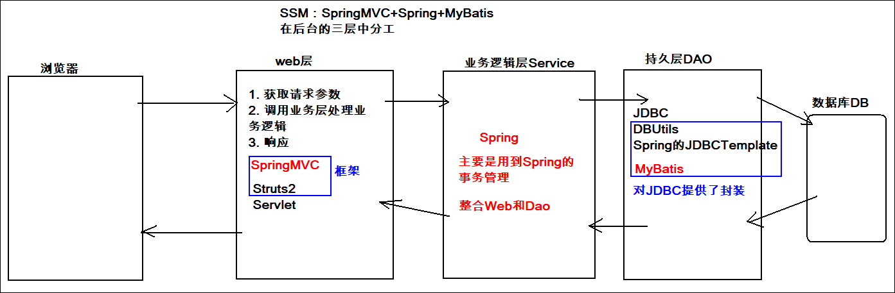

# Spring简介

## Spring是什么

Spring是一款非常优秀的**轻量级**的开源框架，它为JavaEE企业级应用提供了全栈式( full-stack) 解决方案。以 IOC（Inverse Of Control：控制反转）和 AOP（Aspect Oriented Programming：面向切面编程）为内核。 提供了表现层 SpringMVC和持久层 Spring JDBCTemplate以及业务层Service事务管理等众多的企业级应用技术，还能整合开源世界众多著名的第三方框架，逐渐成为使用最多的Java EE 企业应用开源框架。君子框架！


官网：<https://spring.io/>


## Spring的发展历史

```markdown
* EJB（Enterprise Java Beans）重量级框架
    1997 年，IBM提出了EJB 的思想
    1998 年，SUN制定开发标准规范 EJB1.0
    1999 年，EJB1.1 发布
    2001 年，EJB2.0 发布
    2003 年，EJB2.1 发布
    2006 年，EJB3.0 发布
    
* Spring
    Rod Johnson（Spring 之父），改变Java世界的大师级人物
    
    2002年编著《Expert one on one J2EE design and development》
    	指出了JavaEE和EJB组件框架中的存在的一些主要缺陷，并提出了更为简单的解决方案。
    	
    2004年编著《Expert one-on-one J2EE Development without EJB》
    	阐述了JavaEE开发时不使用EJB的解决方式（Spring 雏形）
    	同年4月spring1.0诞生
    	
    2006年10月，发布 Spring2.0
    2009年12月，发布 Spring3.0
    2013年12月，发布 Spring4.0
    2017年09月，发布最新 Spring5.0 通用版（GA）
```


## Spring的优势

```markdown
1. 方便解耦，简化开发
2. AOP编程的支持
	通过Spring的AOP功能，方便进行面向切面编程，许多不容易用传统 OOP 实现的功能可以通过 AOP 轻松实现。
	
	面向切面编程AOP是对面向对象编程OOP的补充！
	切面：也叫方面，事务、日志、性能统计
	
3. 声明式事务的支持
	可以将我们从单调烦闷的事务管理代码中解脱出来，通过声明式方式灵活的进行事务管理，提高开发效率和质量。
4. 方便程序的测试（整合了Junit）
	可以用非容器依赖的编程方式进行几乎所有的测试工作，测试不再是昂贵的操作，而是随手可做的事情。
5. 方便集成各种优秀框架
	Spring对各种优秀框架（Struts、Hibernate、MyBatis、Junit、Quartz等）的支持。
6. 降低JavaEE API的使用难度
	Spring对JavaEEAPI（如Servlet、JDBC等）进行了简单的封装层，使这些 API 的使用难度大为降低。 
```


## Spring的体系结构


# 初识IOC

## IOC介绍

**控制反转（Inverse Of Control）**不是什么技术，而是一种设计==思想==。它的目的是指导我们设计出更加**松耦合**的程序。

> 控制：在java中指的是对象的控制权限（创建、销毁）
>
> ​	例如要使用UserServiceImpl:  UserService userService = new UserServiceImpl()
>
> 反转：指的是对象控制权由原来 **由开发者在类中手动控制** 反转到 **由Spring的IOC容器控制**


## 自定义IOC容器

### 基础环境的搭建

1. 创建一个maven工程
2. 编写dao接口及其实现类
3. 编写测试类对dao层实现类进行测试


### 代码中存在的问题

​	使用了new的方式创建对象：UserDao userDao = new UserDaoImpl();

​	存在的问题：

1. 使用一个对象就得创建一个对象，new的次数比较多的话浪费资源

    		2. 如果更换实现类，需要修改源代码(耦合)。


### 解决方案

开发原则:  对扩展开放，对修改关闭。

使用工厂模式解耦合！

步骤：

1. 编写一个工厂类：MyBeanFactory
2. 在工厂类中定义一个Map集合(IOC容器)
3. 在静态代码块（类加载时执行）中，初始化Map集合
   - 将需要实例化的类的全限定名配置到配置文件（xml或properties）中，这里用xml
   - 读取xml配置文件，使用反射创建类的实例，然后存到Map中
4. 在MyBeanFactory中提供一个静态方法，获取对象


读取xml需要导入依赖(dom4j+xpath)

```xml
<dependencies>
    <dependency>
        <groupId>dom4j</groupId>
        <artifactId>dom4j</artifactId>
        <version>1.6.1</version>
    </dependency>
    <dependency>
        <groupId>jaxen</groupId>
        <artifactId>jaxen</artifactId>
        <version>1.1.6</version>
    </dependency>
    <dependency>
        <groupId>junit</groupId>
        <artifactId>junit</artifactId>
        <version>4.12</version>
        <scope>test</scope>
    </dependency>
</dependencies>
```

```java
package com.bjpowernode.utils;

import org.dom4j.Document;
import org.dom4j.Element;
import org.dom4j.io.SAXReader;

import java.util.*;

public class MyBeanFactory {

    private static Map<String, Object> map = new HashMap<>();

    static {
        //readForXML();
        readForProp();
    }

    // <T>意思是该方法是一个泛型方法
    public static <T> T getBean(String id) {
        return (T)map.get(id);
    }

    private static void readForProp() {
        try {
            ResourceBundle rb = ResourceBundle.getBundle("beans");
            Set<String> keys = rb.keySet();
            for (String key : keys) {
                System.out.println(key);
                String className = rb.getString(key);
                Class clazz = Class.forName(className);
                Object o = clazz.newInstance();
                map.put(key, o);
            }
        } catch (Exception e) {
            e.printStackTrace();
        }
    }

    private static void readForXML() {
        try {
            //加载xml文件到内存,生成document对象
            SAXReader reader = new SAXReader();
            Document doc = reader.read(MyBeanFactory.class.getResourceAsStream("/beans.xml"));

            //获取所有的bean标签(list)
            List<Element> list = doc.selectNodes("//bean");

            //遍历集合,获取到每个bean标签
            for (Element element : list) {
                //获取id属性的值作为map的key
                String key = element.attributeValue("id");
                //获取class属性的值，通过反射创建对象作为map的value
                String className = element.attributeValue("class");
                Object value = Class.forName(className).newInstance();
                //将key和value放入到map中即可
                map.put(key, value);
            }
        } catch (Exception e) {
            e.printStackTrace();
        }
    }
}

```

```java
@Test
public void testUserDao() {
    /*
        对象的创建由程序员在代码中使用new的方式创建
            1. 每次使用都需要new，浪费资源
            2. 如果需要更换实现类，需要修改源代码(耦合)
                假设要将实现类切换成UserDaoImpl2,需要修改为 new UserDaoImpl2();
     */
    //UserDao userDao = new UserDaoImpl();
    // 不需要类型强转
    UserDao userDao = MyBeanFactory.getBean("userDao");
    userDao.save();
}
```


## Spring的IOC（xml方式）快速入门【重点】

需求：使用spring的ioc实现解耦合

使用步骤：

1. 导入spring的依赖(spring-context),若要测试,导入junit包

   ```xml
   <dependency>
       <groupId>org.springframework</groupId>
       <artifactId>spring-context</artifactId>
       <version>5.1.5.RELEASE</version>
   </dependency>
   ```

   

2. 在resources下创建**applicationContext.xml**（Spring的主配置文件）配置文件,在配置文件中将dao配置进去即可

   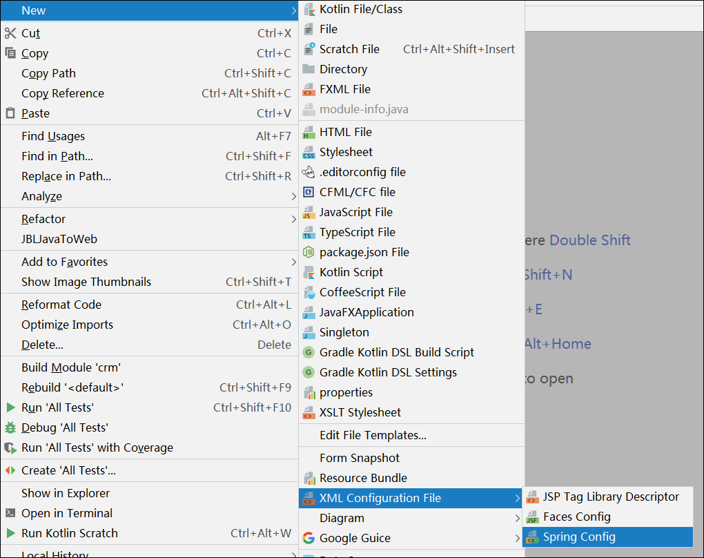

   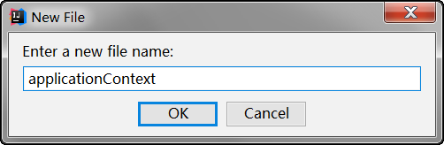

   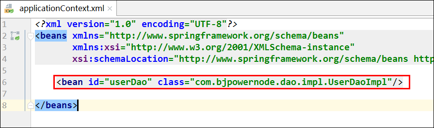

   

3. 通过spring的api创建IOC容器（工厂实例），并从容器中获取实例并使用

   ```java
   @Test
   public void testSpringIOC() {
       // 读取配置文件，获取工厂对象
       BeanFactory beanFactory = new ClassPathXmlApplicationContext("applicationContext.xml");
       // 从工厂中获取实例
       // 根据id获取
       //UserDao userDao = (UserDao) beanFactory.getBean("userDao");
       // 根据类型获取
       UserDao userDao = beanFactory.getBean(UserDao.class);
       userDao.save();
   }
   ```
   
   


# Spring相关API【理解】

Spring的API体系异常庞大，我们只需要关注==ClassPathXmlApplicationContext==

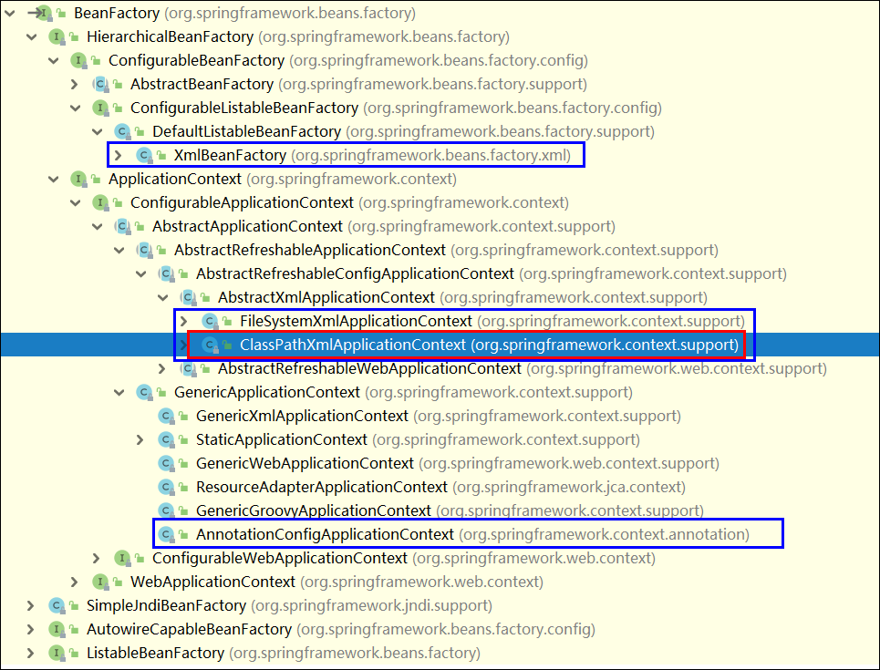


**实现类**

```markdown
* FileSystemXmlApplicationContext【了解】
	功能：从指定磁盘目录加载xml配置文件，创建spring的ioc容器

* ClassPathXmlApplicationContext【重点】
	功能：从类路径下加载xml配置文件，创建spring的ioc容器

* XmlBeanFactory【了解】
	功能：从类路径下加载xml配置文件，创建spring的ioc容器
	与ClassPathXmlApplicationContext的区别：
	XmlBeanFactory：
		调用getBean方法时创建
	ClassPathXmlApplicationContext：
		new ClassPathXmlApplicationContext()时全部创建好放入IOC容器中，
		调用getBean方法时直接从IOC容器中获取
		
* AnnotationConfigApplicationContext【了解】
	功能：加载注解配置类（我们目前使用的是xml配置），创建spring的ioc容器
```


```java
@Test
public void testSpringIOC() {
    // 1. 读取配置文件，获取工厂对象
    // 读取配置文件时，将所有类的实例一次性创建好
    BeanFactory beanFactory = new ClassPathXmlApplicationContext("applicationContext.xml");
    //BeanFactory beanFactory = new FileSystemXmlApplicationContext("d:/applicationContext.xml");
    // XmlBeanFactory是在调用其getBean方法时，才去创建实例
    //BeanFactory beanFactory = new XmlBeanFactory(new ClassPathResource("applicationContext.xml"));
    // 2. 从工厂中获取实例
    // 根据id获取
    //UserDao userDao = (UserDao) beanFactory.getBean("userDao");
    // 根据类型获取**********************
    UserDao userDao = beanFactory.getBean(UserDao.class);
    // 根据id和类型获取
    //UserDao userDao =  beanFactory.getBean("userDao", UserDao.class);
    userDao.save();
}
```


**getBean方法**

```java
1. public Object getBean(String name) throws BeansException;
	功能：通过指定id获取对象的实例，需要手动强转

2. public <T> T getBean(Class<T> requiredType);
	功能：通过指定类型获取对象的实例，不需要强转
	注意：同一个类型下只能有一个对象实例
    
3. public <T> T getBean(String name, Class<T> requiredType);
	功能：通过指定id和类型获取对象的实例
```


# Spring配置文件【重点】

## Bean标签

 ```xml
<?xml version="1.0" encoding="UTF-8"?>
<beans xmlns="http://www.springframework.org/schema/beans"
       xmlns:xsi="http://www.w3.org/2001/XMLSchema-instance"
       xsi:schemaLocation="http://www.springframework.org/schema/beans http://www.springframework.org/schema/beans/spring-beans.xsd">

    <!--
        id: 在IOC容器中的唯一标识
        class: 类的全限定名

        一般只配置id和class即可

        scope:域范围
            常用值:
                singleton:单实例 默认值,工厂初始化的时候就创建好了,一般都使用默认值
                prototype:多实例,什么时候用什么时候创建
                    struts框架(web层框架)中的每个处理类都是多实例的.

        init-method:bean对象创建好之后要执行的方法
        destroy-method:bean对象销毁前要执行的方法
    -->
    <bean id="userDao" class="com.bjpowernode.dao.impl.UserDaoImpl"
          scope="singleton" init-method="init" destroy-method="destroy" />
</beans>
 ```


面试题：

Spring的IOC容器中的实例，是单实例还是多实例？默认是单实例，也可以修改为多实例.

struts2框架是单实例还是多实例，默认是多实例，也可以修改为单实例。


## spring创建对象实例三种方式

### 构造方法实例化【重点】

```xml
<!-- 使用无参构造创建对象 -->
<bean id="userDao" class="com.bjpowernode.dao.impl.UserDaoImpl" />
```


### 工厂静态方法实例化【了解】

**应用场景**

​		某工厂类中有个**静态方法getBean**，getBean方法的返回值是一个对象。如果我们频繁使用该对象，此时我们可以将该对象的创建权交给spring的IOC容器，以后我们在使用该对象时，无需调用工厂类中的getBean方法，直接从IOC容器获得

步骤:

1. 创建一个工厂类，提供一个静态方法,可以返回一个SimpleDateFormat对象

    ```java
    package com.bjpowernode.utils;
    
    public class MyBeanFactory {
        public static DateFormat createSDFYYYYMMDDHHMMSS(String format) {
            return new SimpleDateFormat(format);
        }
    }
    ```
    
2. 配置applicationContext.xml

    ```xml
    <!--
        工厂静态方法创建实例
            class:配置的是工厂的全限定类名
            factory-method:配置的是能创建对象的静态方法名称
    -->
    <bean id="YYYYMMDDHHMMSS" class="com.bjpowernode.utils.MyBeanFactory" 
          factory-method="createSDFYYYYMMDDHHMMSS">
    <!--方法中的参数-->
        <constructor-arg name="format" value="yyyy/MM/dd HH:mm:ss" />
    </bean>
    ```
    
    


### 工厂普通方法实例化【了解】

**应用场景**

​		某工厂类中有个**普通方法getBean**，getBean方法的返回值是一个对象。如果我们频繁使用该对象，此时我们可以将该对象的创建权交给spring的IOC容器，以后我们在使用该对象时，无需调用工厂类中的getBean方法，直接从IOC容器获得

步骤:

1. 创建一个工厂类，提供一个**普通**方法,可以返回一个SimpleDateFormat对象

    ```java
    package com.bjpowernode.utils;
    
    public class MyBeanFactory {
        public DateFormat createSDFYYYYMMDD(String format) {
            return new SimpleDateFormat(format);
        }
    }
    ```
    
2. 配置applicationContext.xml

    ```xml
    <!--工厂实例方法创建实例-->
    <!--1. 先创建工厂的实例-->
    <bean id="myBeanFactory" class="com.bjpowernode.utils.MyBeanFactory" />
    <!--
    	2. 指定哪个实例中的哪个方法
    		factory-bean:使用已经配置好的工厂对象
            factory-method:指定使用工厂对象的那个方法创建dao
    -->
    <bean id="YYYYMMDD" factory-bean="myBeanFactory" factory-method="createSDFYYYYMMDD">
        <!--方法中的参数-->
    <constructor-arg name="format" value="yyyy/MM/dd" />
    </bean>
    ```
    
    

# Bean依赖注入概述

**DI（Dependency Injection）依赖注入**：它是 Spring 框架核心 IOC 的具体实现。

spring创建对象的时候要将对象里面的成员字段通过依赖注入进行初始化操作。

## set方法注入【重点】

```java
public class UserServiceImpl implements UserService {
    private String username;
    private UserDao userDao;

    public void setUsername(String username) {
        this.username = username;
    }

    public void setUserDao(UserDao userDao) {
        this.userDao = userDao;
    }
}
```


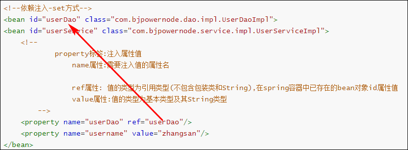

```xml
<!--依赖注入-set方式-->
<bean id="userDao" class="com.bjpowernode.dao.impl.UserDaoImpl">
<bean id="userService" class="com.bjpowernode.service.impl.UserServiceImpl">
    <!--
            property标签:注入属性值
                name属性:需要注入值的属性名

                ref属性: 值的类型为引用类型(不包含包装类和String),在spring容器中已存在的bean对象id属性值
                value属性:值的类型为基本类型及其String类型
        -->
    <property name="userDao" ref="userDao"/>
    <property name="username" value="zhangsan"/>
</bean>
```


## 构造方法注入

```java
public class UserServiceImpl implements UserService {
    private String username;
    private UserDao userDao;

    public UserServiceImpl(UserDao userDao, String username) {
        this.userDao = userDao;
        this.username = username;
    }
}
```

```xml
<!--依赖注入-构造方法方式-->
<bean id="userDao" class="com.bjpowernode.dao.impl.UserDaoImpl">
<bean id="userService" class="com.bjpowernode.service.impl.UserServiceImpl">
    <!--
            constructor-arg:通过构造器的参数注入值
                name属性:参数名字
                ref属性: 值的类型为引用类型(不包含包装类和String),在spring容器中已存在的bean对象id属性值
                value属性:值的类型为基本类型及其String类型
        -->
    <constructor-arg name="userDao" ref="userDao"/>
    <constructor-arg name="username" value="zhangsan"/>
</bean>

```


 

## p命名空间注入(了解)

**本质上也是set方法注入，在此基础上进行了简化**

使用步骤:

1. 需要在spring的配置文件中引入p名称空间

    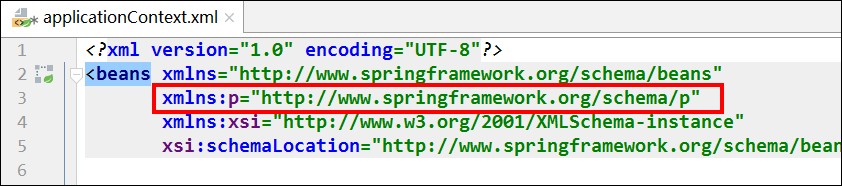

2. 在需要注入的bean标签中通过 `p:属性=""` 或者 `p:属性-ref=""`方式注入

    ```xml
    <?xml version="1.0" encoding="UTF-8"?>
    <beans xmlns="http://www.springframework.org/schema/beans"
           xmlns:p="http://www.springframework.org/schema/p"
           xmlns:xsi="http://www.w3.org/2001/XMLSchema-instance"
           xsi:schemaLocation="http://www.springframework.org/schema/beans http://www.springframework.org/schema/beans/spring-beans.xsd">
        
        <bean id="userDao" class="com.bjpowernode.dao.impl.UserDaoImpl" />
        
        <!--命名空间注入，不推荐使用，对于复杂值的注入，不方便，不如property清晰-->
        <bean id="userService" class="com.bjpowernode.crm.service.impl.UserServiceImpl"
              p:userDao-ref="userDao"
              p:username="zhangsan"/>
</beans>
    ```
    
    


## Bean依赖注入的数据类型

### 普通数据类型

基本类型和string，通过标签的value属性注入数据

```xml
<property name="name" value="张三" />
```


### 引用数据类型

通过标签的ref属性注入数据，被注入属性的值应该在Spring的IOC容器中

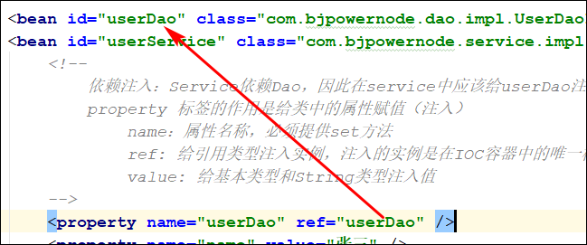

### 集合数据类型(了解)

**单列集合**

> list、set、array
>
> 都可以使用其中的任意一个单列标签


**双列集合**

> map、properties


```java
package com.bjpowernode.domain;

import com.bjpowernode.dao.UserDao;

import java.util.List;
import java.util.Map;
import java.util.Properties;
import java.util.Set;

public class TestBean {
    private String username;
    private UserDao userDao;
    
    private List list;
    private Set set;
    private int[] array;
    private Map map;
    private Properties properties;

    public void setUsername(String username) {
        this.username = username;
    }

    public void setUserDao(UserDao userDao) {
        this.userDao = userDao;
    }

    public void setList(List list) {
        this.list = list;
    }

    public void setSet(Set set) {
        this.set = set;
    }

    public void setArray(int[] array) {
        this.array = array;
    }

    public void setMap(Map map) {
        this.map = map;
    }

    public void setProperties(Properties properties) {
        this.properties = properties;
    }
}
```


```xml
<bean id="userDao" class="com.bjpowernode.dao.impl.UserDaoImpl" />

<!--依赖注入-集合类型-->
<bean id="testBean" class="com.bjpowernode.domain.TestBean">
    <property name="userDao" ref="userDao"/>
    <property name="username" value="zhangsan"/>
    
    <!--单列-->
    <property name="list">
        <list>
            <value>zhangsan</value>
            <ref bean="userDao"/>
            <bean class="java.util.Date" />
        </list>
    </property>
    <property name="set">
        <set>
            <value>zhangsan</value>
            <ref bean="userDao"/>
            <bean class="java.util.Date" />
        </set>
    </property>
    <property name="array">
        <array>
            <value>1</value>
            <value>2</value>
        </array>
    </property>

    <!--双列-->
    <property name="map">
        <map>
            <entry key="m1" value="mvalue1" />
            <entry key="m2" value="mvalue2" />
        </map>
    </property>
    <property name="properties">
        <props>
            <prop key="p1">pvalue1</prop>
            <prop key="p2">pvalue2</prop>
        </props>
    </property>
</bean>
```


# 配置文件模块化(了解！)

进入企业开发我们会按模块来进行配置文件配置，将现有的配置文件的抽取

**并集配置【了解】**

```java
@Test
public void testCollectionBean(){
    //ApplicationContext context = new ClassPathXmlApplicationContext("springbeans.xml");
    ApplicationContext context = new ClassPathXmlApplicationContext("springbeans.xml","spring-di.xml");
}
```

**主从配置【重点】**

在spring的主配置文件applicationContext.xml中通过import标签引入其他的配置文件即可

`<import resource="spring-di.xml"/>`

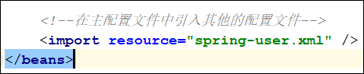


# DBUtils

## DBUtils概述

DBUtils是Apache的一款用于简化Dao代码的工具类，它底层封装了JDBC技术。

**核心对象**

QueryRunner:执行sql语句对象

构造器1:

`QueryRunner runner = new QueryRunner()`

构造器2(今天使用):

`QueryRunner runner = new QueryRunner(DataSource ds)`


**核心方法**

`int update(String sql语句,Object ... ?对应的参数值)`:执行cud操作,对应的带参的构造器

`int update(Connection conn,String sql语句,Object ... ?对应的参数值)`:执行cud操作,对应的**无参**的构造器

`query(String sql语句,ResultSetHandler hl,Object ... ?对应的参数值)`:执行查询操作,对应的带参构造器

`query(Connection conn,String sql语句,ResultSetHandler hl,Object ... ?对应的参数值)`:执行查询操作,对应的**无参**构造器

**快速入门**

1. 创建数据库和表
2. 在项目中导入依赖
   - mysql驱动,junit,dbutils,duird
3. 编写dao,完成保存操作

```sql
Create database spring01;
use spring01;
CREATE TABLE `account` (
  `id` int(11) NOT NULL AUTO_INCREMENT,
  `name` varchar(32) DEFAULT NULL,
  `money` double DEFAULT NULL,
  PRIMARY KEY (`id`)
) ENGINE=InnoDB AUTO_INCREMENT=3 DEFAULT CHARSET=utf8;

insert  into `account`(`id`,`name`,`money`) values (1,'tom',1000),(2,'jack',1000);
```

pom.xml

```xml
<dependency>
    <groupId>junit</groupId>
    <artifactId>junit</artifactId>
    <version>4.12</version>
</dependency>
<dependency>
    <groupId>com.alibaba</groupId>
    <artifactId>druid</artifactId>
    <version>1.1.12</version>
</dependency>
<dependency>
    <groupId>mysql</groupId>
    <artifactId>mysql-connector-java</artifactId>
    <version>5.1.20</version>
</dependency>
<dependency>
    <groupId>commons-dbutils</groupId>
    <artifactId>commons-dbutils</artifactId>
    <version>1.7</version>
</dependency>
```

Account类

```java
public class Account {
    private Integer id;
    private String name;
    private Double money;
}
```

AccountDaoImpl

```java
public class AccountDaoImpl implements AccountDao {

    private QueryRunner runner = new QueryRunner(JdbcUtils.getDataSource());

    @Override
    public void save(Account account) throws SQLException {
        //sql中的参数使用?作为占位符
        String sql = "insert into account values(null,?,?)";
        runner.update(sql,account.getName(),account.getMoney());
    }
}
```

```java
public class TestQueryRunner {

    @Test
    public void testHello() throws SQLException {
        AccountDao accountDao = new AccountDaoImpl();
        Account account = new Account();
        account.setName("肉丝");
        account.setMoney(100.0);
        accountDao.save(account);
    }
}
```

从资料中复制了数据库连接的properties文件和JdbcUtils工具类

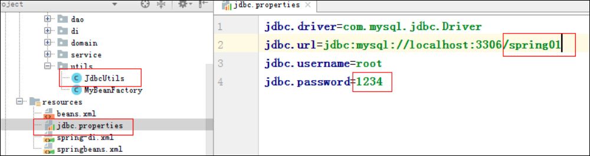


### 查询操作

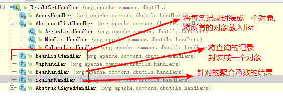

AccountDaoImpl中的代码

```java
@Override
public Long findTotalRecord() throws SQLException {
    String sql = "select count(1) from account";
    return (Long)runner.query(sql,new ScalarHandler());
}

@Override
public List<Account> findAll() throws SQLException {
    String sql = "select * from account";
    return runner.query(sql,new BeanListHandler<Account>(Account.class));
}
```


## Spring整合DBUtils

**需求**

​	基于Spring的xml配置，实现账户的CRUD案例

**技术分析**

​	spring的ioc和dbutils

**步骤分析**

1. 新建一个项目

2. 导入依赖

   ```xml
   <dependencies>
       <dependency>
           <groupId>org.springframework</groupId>
           <artifactId>spring-context</artifactId>
           <version>5.2.8.RELEASE</version>
       </dependency>
       <dependency>
           <groupId>mysql</groupId>
           <artifactId>mysql-connector-java</artifactId>
           <version>5.1.20</version>
       </dependency>
       <dependency>
           <groupId>com.alibaba</groupId>
           <artifactId>druid</artifactId>
           <version>1.1.12</version>
       </dependency>
       <dependency>
           <groupId>commons-dbutils</groupId>
           <artifactId>commons-dbutils</artifactId>
           <version>1.7</version>
       </dependency>
       <dependency>
           <groupId>junit</groupId>
           <artifactId>junit</artifactId>
           <version>4.12</version>
           <scope>test</scope>
       </dependency>
   </dependencies>
   ```

   

3. 创建Account类

4. 创建AccountDao及其实现类
   - 需要注入QueryRunner对象
   - QueryRunner对象创建的时候需要注入DataSource

5. 创建AccountService及其实现类

   - 需要注入AccountDao即可


**代码实现**

* ### dao中的代码

```java
public class AccountDaoImpl implements AccountDao {
    private QueryRunner qr;

    public void setQr(QueryRunner qr) {
        this.qr = qr;
    }

    @Override
    public void save(Account account) {
        try {
            String sql = "insert into account values(null, ?,?)";
            qr.update(sql, account.getName(), account.getMoney());
        } catch (SQLException e) {
            e.printStackTrace();
            throw new RuntimeException("保存失败！");
        }
    }

    @Override
    public Account get(int id) {
        try {
            String sql = "select * from account where id=?";
            return qr.query(sql, new BeanHandler<Account>(Account.class), id);
        } catch (SQLException e) {
            e.printStackTrace();
            throw new RuntimeException("查询一个失败！");
        }
    }

    @Override
    public List<Account> getAll() {
        try {
            String sql = "select * from account";
            return qr.query(sql, new BeanListHandler<Account>(Account.class));
        } catch (SQLException e) {
            e.printStackTrace();
            throw new RuntimeException("查询所有失败！");
        }
    }

    @Override
    public void delete(int id) {
        try {
            String sql = "delete from account where id=?";
            qr.update(sql, id);
        } catch (SQLException e) {
            e.printStackTrace();
            throw new RuntimeException("删除失败！");
        }
    }

    @Override
    public void update(Account account) {
        try {
            String sql = "update account set money=? where name=?";
            qr.update(sql, account.getMoney(), account.getName());
        } catch (SQLException e) {
            e.printStackTrace();
            throw new RuntimeException("更新失败！");
        }
    }
}
```


* ### service中的代码

```java
public class AccountServiceImpl implements AccountService {

    private AccountDao accountDao;

    public void setAccountDao(AccountDao accountDao) {
        this.accountDao = accountDao;
    }

    @Override
    public void save(Account account) {
        accountDao.save(account);
    }

    @Override
    public Account get(int id) {
        return accountDao.get(id);
    }

    @Override
    public List<Account> getAll() {
        return accountDao.getAll();
    }

    @Override
    public void delete(int id) {
        accountDao.delete(id);
    }

    @Override
    public void update(Account account) {
        accountDao.update(account);
    }
}
```


* ### spring配置文件中的代码


applicationContext.xml

```xml
<?xml version="1.0" encoding="UTF-8"?>
<beans xmlns="http://www.springframework.org/schema/beans"
       xmlns:xsi="http://www.w3.org/2001/XMLSchema-instance"
       xsi:schemaLocation="http://www.springframework.org/schema/beans http://www.springframework.org/schema/beans/spring-beans.xsd">


    <!--配置数据源-->
    <bean id="dataSource" class="com.alibaba.druid.pool.DruidDataSource">
        <property name="driverClassName" value="com.mysql.jdbc.Driver" />
        <property name="url" value="jdbc:mysql://127.0.0.1:3306/spring01" />
        <property name="username" value="root" />
        <property name="password" value="1234"/>
    </bean>

    <!-- new QueryRunner(DataSource ds); -->
    <bean id="qr" class="org.apache.commons.dbutils.QueryRunner">
        <constructor-arg name="ds" ref="dataSource"/>
    </bean>

    <bean id="accountDao" class="com.bjpowernode.dao.impl.AccountDaoImpl">
        <property name="qr" ref="qr" />
    </bean>

    <bean id="accountService" class="com.bjpowernode.service.impl.AccountServiceImpl">
        <property name="accountDao" ref="accountDao" />
    </bean>
</beans>
```


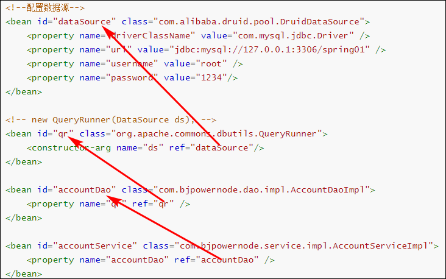

* ### 测试

```java
public class TestAccount {
    @Test
    public void testServiceSave() {
        // 1. 获取工厂对象
        BeanFactory factory = new ClassPathXmlApplicationContext("applicationContext.xml");
        // 2. 获取对象实例
        AccountService accountService = factory.getBean(AccountService.class);
        Account account = new Account();
        account.setName("李四");
        account.setMoney(2000);
        accountService.save(account);
    }

    @Test
    public void testServiceGet() {
        // 1. 获取工厂对象
        BeanFactory factory = new ClassPathXmlApplicationContext("applicationContext.xml");
        // 2. 获取对象实例
        AccountService accountService = factory.getBean(AccountService.class);
        Account account = accountService.get(1);

        System.out.println(account);
    }

    @Test
    public void testServiceGetAll() {
        // 1. 获取工厂对象
        BeanFactory factory = new ClassPathXmlApplicationContext("applicationContext.xml");
        // 2. 获取对象实例
        AccountService accountService = factory.getBean(AccountService.class);

        List<Account> aList = accountService.getAll();
        System.out.println(aList);
    }
}
```


## 抽取jdbc配置

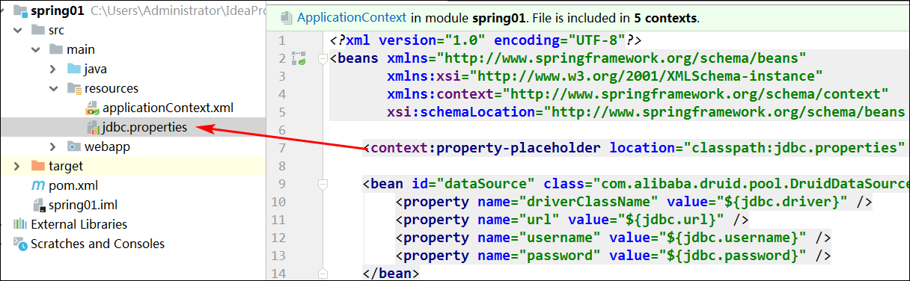
