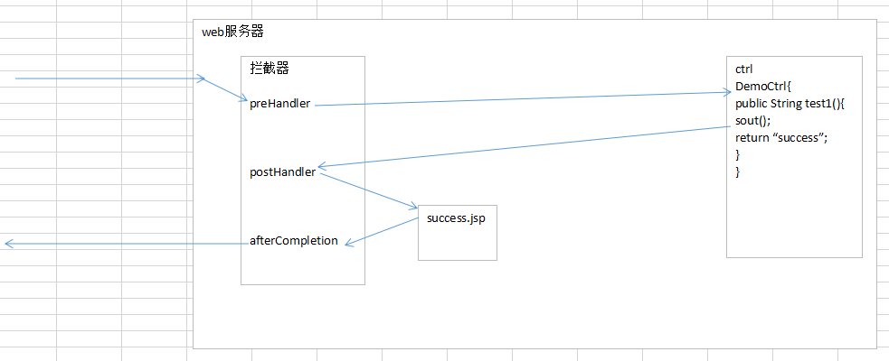

# Spring05

# SpringMVC简介

## MVC模式简介

MVC是软件工程中的一种软件架构模式，它是一种将**==业务逻辑与显示界面分离==**的开发思想。

```markdown
* M（model）模型：处理业务逻辑、数据库操作等
* V（view） 视图：展示内容
* C（controller）控制器：负责调度分发（1.接收请求、2.调用模型、3.选择视图）
```


## SpringMVC简介

SpringMVC 是基于 Java 实现的 轻量级 Web 框架，是Spring 的后续产品。 

SpringMVC 是目前最主流的MVC框架，没有之一，随着Spring3.0 的发布，全面超越 Struts2，成为最优秀的 MVC 框架。

SpringMVC通过一套注解，让一个简单的 Java 类成为处理请求的控制器，而无须实现 Servlet 接口。

SpringMVC提供了一个核心Servlet（DispatcherServlet），她封装了Servlet（Controller）的==共有行为==，如参数的获取、视图的选择等，使开发者只需要关注 Servlet 的特有行为，如调用模型来处理业务逻辑、将数据保存到作用域等，以此来提高开发效率。


要想处理共有行为，就需要获取到request和response对象，谁能获取到这两个对象？


* Servlet
* Filter

springMVC使用的是 **==Servlet==** 来处理共有行为。

Struts2(web层框架)使用的是 Filter 来处理共有行为。


## 快速入门

需求：在index.jsp上有一个连接(`/hello.html`)，点击连接，在控制台打印一句话，然后转发到 /WEB-INF/jsp/success.jsp


实现步骤：

1. 新建一个web项目,导入依赖
   - spring-webmvc
   - servlet（使用原生的ServletAPI时才能用到）
   
2. 在webapp目录下编写index.jsp,添加一个a标签

3. 创建一个类HelloController

   - 在类上需要添加一个注解**@Controller**

   - 在类中编写一个sayHello方法

       - 方法返回String类型，返回值就是要转发的路径

       - 在方法上添加**@RequestMapping**(=="hello.html"==)

4. 编写springmvc的核心配置文件。
   - 组件扫描
   - 开启springmvc中注解支持

5. 在web.xml中配置DispatcherServlet(核心控制器)


### pom.xml

```xml
<dependencies>
    <dependency>
        <groupId>org.springframework</groupId>
        <artifactId>spring-webmvc</artifactId>
        <version>5.2.8.RELEASE</version>
    </dependency>
    <dependency>
        <groupId>javax.servlet</groupId>
        <artifactId>javax.servlet-api</artifactId>
        <version>4.0.1</version>
        <scope>provided</scope>
    </dependency>
</dependencies>
```


### controller代码

```java
@Controller
public class HelloController {
    @RequestMapping("hello")
    public String sayHello(){
        System.out.println("controller收到了请求");
        //return "/WEB-INF/jsp/success.jsp";
        // 配置了视图解析器
        return "success";
    }
}
```


### spring-mvc.xml

```xml
<!--开启组件扫描-->
<context:component-scan base-package="com.powernode.web" />

<!--开启mvc注解支持-->
<mvc:annotation-driven />

<!--配置视图解析器-->
<bean class="org.springframework.web.servlet.view.InternalResourceViewResolver">
    <!--配置前缀-->
    <property name="prefix" value="/WEB-INF/jsp/"/>
    <!--配置后缀-->
    <property name="suffix" value=".jsp"/>
</bean>
```


### web.xml

```xml
<!--配置前端控制器-->
<servlet>
    <servlet-name>DispatcherServlet</servlet-name>
    <servlet-class>org.springframework.web.servlet.DispatcherServlet</servlet-class>
    <init-param>
        <!--指定springmvc配置文件的路径-->
        <param-name>contextConfigLocation</param-name>
        <param-value>classpath:spring-mvc.xml</param-value>
    </init-param>
    <!--修改servelt的初始化时机-->
    <load-on-startup>1</load-on-startup>
</servlet>
<servlet-mapping>
    <servlet-name>DispatcherServlet</servlet-name>
    <url-pattern>/</url-pattern>
</servlet-mapping>
```


# SpringMVC组件(了解)

## 核心控制器(最重要)

也叫前端控制器，这里的前端指的是位置

```markdown
- DispatcherServlet
    	整个流程控制的核心，调用其他组件处理用户的请求，简化Servlet共有行为的处理。
```


## 三大组件

```markdown
- HandleMapping：处理器映射器
    	根据请求对象(中的url)获取到 处理程序执行链对象，该对象中包括处理程序 Handler（Controller） 和拦截器(类似过滤器) Interceptor
    
- HandleAdpater：处理器适配器
    	执行处理程序 Handler 的对象，由该对象去执行 处理器映射器 找到的处理程序，处理器适配器内部对请求数据进行了各种处理，目的是简化请求数据的获取
    	
- ViewResolver：视图解析器
    	将逻辑视图解析为View对象（真实资源文件对象）
```


## 其它组件

```markdown
- Handler 【自己写的controller层】
    	处理程序，处理业务逻辑（特有行为）
    	
- Interceptor：拦截器，类似过滤器
		权限控制，例如登录权限
		
- Model: 模型
		存放渲染视图所需的数据，之前是存在request中的

- View：【JSP、HTML】
    	渲染 View
```


我们需要做的事情:

1. 在web.xml中配置核心控制器DispatcherServlet
2. 编写处理器（controller）和 视图（jsp）


# SpringMVC的执行流程(面试题)


```markdown
1. 用户发起请求到核心控制器 DispatcherServlet
2. 处理器映射器 HandlerMapping 根据请求对象获取处理器执行链 HandlerExecutionChain。
		该对象中包括处理程序Handler和拦截器Interceptor数组
3. 为处理程序查找合适的处理器适配器 HandlerAdapter，该对象用于真正的调用处理程序Handler
4. 处理器适配器 HandlerAdapter 调用处理程序 Handler，返回模型和视图对象 ModelAndView
5. 核心控制器请求视图解析器去进行视图解析（将逻辑视图转化成完整的视图地址）
6. 核心控制器将Model交给View进行视图渲染
7. View将结果响应给浏览器
```


# 常用注解解析

@Controller: @Component注解的别名

* 在类（控制器）上使用，将此类的对象交给spring容器管理

@RequestMapping

* 在类和方法使用，确定访问路径和类及类中方法的映射关系
* 在类上使用时，value值作为一级路径(模块)存在，方便团队分模块开发
* 在方法上使用时，value值作为二级路径

常用属性

* **==value属性==**：一级或二级路径
* method : 确定请求方式，只能使用指定的请求方式
* params 指定请求的时候必须携带指定的参数(或者参数及其对应的值)

```java
@Controller
@RequestMapping("requestMapping")
public class B_RequestMappingController {

    @RequestMapping("test1")
    public String test1(){
        System.out.println("test1执行了");
        return "success";
    }

    //method : 确定请求方式,只能使用指定的请求方式,否则报错
    @RequestMapping(value = "test2",method = {RequestMethod.POST,RequestMethod.GET})
    public String test2(){
        System.out.println("test2执行了");
        return "success";
    }

    //params 指定请求的时候必须携带指定的参数(或者参数及其对应值),否则报错
    @RequestMapping(value = "test3",params = "username")
    public String test3(){
        System.out.println("test3执行了");
        return "success";
    }

    //params 指定请求的时候必须携带指定的参数(或者参数及其对应值),否则报错
    @RequestMapping(value = "test4",params = "username=jack")
    public String testr(){
        System.out.println("test3执行了");
        return "success";
    }
}
```


# SpringMVC的请求（重点）

## 接收请求参数

* ==参数是基本数据类型和String类型时，请求参数的名称和方法变量名称保持一致即可==
* ==参数是对象类型时，请求参数的名称和对象中属性名保持一致==
* ==数组类型==
* 集合（List、Map）类型.使用==ognl表达式==,将表单中的数据封装给对象中的集合类型（了解）


```html
<a href="/param/test01?username=tom&age=18">c_接受基本类型和string类型参数</a>
<form action="/param/test02" method="post">
    <fieldset>
        <legend>c_封装成javabean</legend>
        银行名称:<input name="bankName"><br>
        银行余额:<input name="money"><br>
        <input type="submit"/>
    </fieldset>
</form>
<br>

<form action="/param/test03" method="post">
    <fieldset>
        <legend>c_封装成数组</legend>
        <input name="id" type="checkbox" value="1">1<br>
        <input name="id" type="checkbox" value="2">2<br>
        <input name="id" type="checkbox" value="3">3<br>
        <input name="id" type="checkbox" value="4">4<br>
        <input name="id" type="checkbox" value="5">5<br>
        <input type="submit"/>
    </fieldset>
</form>
<br>
<a href="/param/test03?id=1,2,3">c2_将以逗号分隔的字符串封装成数组</a>
<br>

<form action="/param/test04" method="post">
    <fieldset>
        <legend>c_封装成javabean中集合</legend>
        用户名称:<input name="username"><br>
        用户年龄:<input name="age"><br>

        User对象中的Account对象-accountNo<input name="account.accountNo"><br>
        User对象中的Account对象-balance<input name="account.balance"><br>

        字符串List集合第1个元素:<input name="strList[0]"><br>
        字符串List集合第2个元素:<input name="strList[1]"><br>

        对象集合List1-accountNo:<input name="accountList[0].accountNo"><br>
        对象集合List1-balance:<input name="accountList[0].balance"><br>

        对象集合List2-accountNo:<input name="accountList[1].accountNo"><br>
        对象集合List2-balance:<input name="accountList[1].balance"><br>

        map集合(值为简单类型)-key1:<input name="map['key1']"><br>
        map集合(值为简单类型)-key2:<input name="map['key2']"><br>

        map集合(值为对象类型)-key1-accountNo:<input name="accountMap['account1'].accountNo"><br>
        map集合(值为对象类型)-key1-balance:<input name="accountMap['account1'].balance"><br>


        <input type="submit"/>
    </fieldset>
</form>
<br>
```


```java
@Controller
@RequestMapping("param")
public class C_ParamController {
    // 简单类型数据的获取：基本数据类型和String类型(请求参数的名称和方法变量名称保持一致)
    //http://127.0.0.1/param/test01?username=jack&age=20
    @RequestMapping("test01")
    public String test01(int age, String username) {
        System.out.println(username+"::"+age);
        return "success";
    }

    @RequestMapping("test02")
    public String test01(User user) {
        System.out.println(user);
        return "success";
    }

    @RequestMapping("test03")
    public String test01(int[] id) {
        System.out.println(Arrays.toString(id));
        return "success";
    }

    @RequestMapping("test04")
    public String test04(User user) {
        System.out.println(user);
        return "success";
    }
}

```


## post请求中文过滤器

spring已经提供了一个过滤器CharacterEncodingFilter,我们只需要去web.xml中配置即可

```xml
<!--配置字符编码过滤器-->
<filter>
    <filter-name>CharacterEncodingFilter</filter-name>
    <filter-class>org.springframework.web.filter.CharacterEncodingFilter</filter-class>
    <init-param>
        <!--指定post请求的编码-->
        <param-name>encoding</param-name>
        <param-value>utf-8</param-value>
    </init-param>
</filter>
<filter-mapping>
    <filter-name>CharacterEncodingFilter</filter-name>
    <url-pattern>/*</url-pattern>
</filter-mapping>
```


## 类型转换

​	如果我们提交的是一个字符串类型的日志，那么springMVC框架会自动转换为日期类型，要求：字符串格式必须为:`yyyy/MM/dd`，如果不是此格式那么转换失败，但是对于国内用户而言习惯日期格式：`yyyy-MM-dd`，这个时候就需要我们自定义类型转换器

### 方式1:在需要转换的字段上面添加注解


缺点：只能使用指定的格式处理日期，不够灵活

### 方式2:自定义转换器

```markdown
1. 编写一个类 实现Converter接口(原来的类型,目标类型),重新转换的方法
2. 在spring-mvc.xml配置文件中配置自定义转换器服务
3. 进行测试
```

```java
public class String2DateConverter implements Converter<String, Date> {
    @Override
    public Date convert(String source) {
        // source是原始值
        if (source == null || source.isEmpty()) {
            return null;
        }

        // 2020/5/10 5:10:1 ===> 2020-5-10 5:10:1
        source = source.replace("/", "-");

        // 2020-5-10 5:10:1 ===> 2020-05-10 05:10:01
        source = source.replaceAll("(?<=\\D)(?=\\d\\b)", "0");

        String pattern = "yyyy-MM-dd HH:mm:ss".substring(0, source.length());
        SimpleDateFormat sdf = new SimpleDateFormat(pattern);

        try {
            return sdf.parse(source);
        } catch (ParseException e) {
            throw new IllegalArgumentException(e.getMessage());
        }
    }
}
```


在spring-mvc.xml中配置


## 其它相关注解

==@RequestParam==（了解）

* 当请求的参数名和方法中参数名不一致的时候,可以使用此注解形成对应关系.还可以设置默认值

```java
@RequestMapping("test2")
/* @RequestParam 用来将页面上传到过来的参数封装给方法中指定的参数,
            value属性:页面上参数的名称
            defaultValue属性:默认值,当页面上没有传递此参数的时候,就使用此默认值
     */
public String test2(@RequestParam(value="username",defaultValue = "") String name){
    System.out.println(name);
    return "success";
}
```


@RequstHeader(了解)

* 获取指定的请求头

@CookieValue(了解)

* 获取指定cookie的值

```java
@RequestMapping("test3")
public String test3(@RequestHeader("user-agent") String agent,@CookieValue("JSESSIONID") String jSessionID){
    System.out.println("浏览器的版本信息:"+agent);
    System.out.println("jsessionid为:"+jSessionID);
    return "success";
}
```


## 获得原生ServletAPI(重要)

### 方式1:在方法中添加参数即可

### 方式2:通过注入的方式

```java
@Controller
@RequestMapping("api")
public class B_ApiController {
	//方式2
    @Autowired
    HttpServletRequest request;
    @Autowired
    HttpServletResponse response;
    @Autowired
    HttpSession session;

    @RequestMapping("test1")
    //方式1
    public String test1(HttpServletRequest request, HttpServletResponse response, HttpSession session){
        System.out.println(request);
        System.out.println(response);
        System.out.println(session);
        return "success";
    }
	
    @RequestMapping("test2")
    public String test2(){
        System.out.println(request);
        System.out.println(response);
        System.out.println(session);
        return "success";
    }
}
```


## 静态资源处理


每个web服务器都实现了servlet-api和jsp-api,提供了两个servlet(DefaultServlet和JspServlet)

因为我们目前前端控制器的拦截路径为"/",覆盖了web服务器中的默认servlet(处理其他servlet都处理不了的请求).当访问除了jsp之外,其他的请求都会到前端控制器上.

servlet的路径配置:

1. 完全路径  /a/b
2. 通配符匹配  /a/*
3. 扩展名匹配  *.jsp  *.do  *.action
4. 缺省路径  /   默认servlet使用,一般不要轻易使用此路径

完全路径>通配符匹配>扩展名匹配>缺省匹配


### 方式1:修改dispatcherservlet的匹配规则

修改web.xml

将 / 修改为 *.do,这样的话,页面中所有的连接都需要改成 xx.do.这样的话我们的前端控制器就只处理以".do"结尾的请求了.其他的请求交给服务器来处理


### 方式2:通过springMVC框架自定义映射关系

在spring-mvc.xml添加如下配置

```xml
<!--建立静态资源映射关系
    mapping:请求路径
    location:项目中资源的路径
	cache-period：在客户端（浏览器）缓存的时间
-->
<mvc:resources mapping="/static/**" location="/static/" cache-period="${3600*24*10}" />
```


### 方式3:开启静态资源servlet支持

在spring-mvc.xml添加如下配置

```xml
<!--开启tomcat默认静态资源映射 若访问的是静态资源就交给web服务器中默认servlet处理-->
<mvc:default-servlet-handler/>
```


方式2和方式3可以同时开启


# SpringMVC的响应

## 方法的返回值-响应方式介绍

* 字符串
    * 默认就是转发
    * 使用forward和redirect两个关键字来说明是转发还是重定向
* void
    * 使用原生的api就行处理 例如:文件下载
* ModelAndView
    * 此对象中包含了往域中存放的数据和跳转的视图

## String返回

### 默认方式

返回的是一个逻辑视图(例如:success,有可能不存在),这个逻辑视图对应文件在哪里,需要通过视图解析器来确定

### 转发和重定向

一旦使用了转发或者此对象关键字,就不再使用视图解析器了.

若想往request域中存放数据,可以通过Map或者modelMap或者Model都可以,因为他们都是map

```java
@RequestMapping("test1")
//返回值 字符串 : 重定向
//重定向到站外资源 直接写网址即可
//重定向到站内资源 虚拟目录不用写 以前写:/springmvc/1.jsp  现在:/1.jsp
public String test1(){
    return "redirect:/1.jsp";
}

@RequestMapping("test2")
//返回值 字符串 : 转发
//转发写内部路径即可
//public String test2(Map map){
//public String test2(ModelMap map){
public String test2(Model model){
    //往request域中存放数据
    map.put("msg","转发成功了");
    //return "success";
    return "forward:/WEB-INF/jsp/success.jsp";
}
```

## void返回

就是使用原生api进行操作即可,下载文件的时候用

==返回void时，方法中必须要有HttpServletResponse参数，否则报错！==

```java
@RequestMapping("test4")
public void test4(HttpServletRequest request, HttpServletResponse response) throws IOException {
    //重定向
    response.sendRedirect("/1.jsp");

    //打印流
    //response.getWriter().println("hello");
}

@RequestMapping("test5")
public void test5(HttpServletRequest request, HttpServletResponse response) throws ServletException, IOException {
    request.getRequestDispatcher("/WEB-INF/jsp/success.jsp").forward(request,response);
    }
```


## ModelAndView返回(掌握)

### 方式一:在方法中创建

### 方式二:在方法的参数上声明

```java
//返回值为modelAndView
@RequestMapping("test6")
public ModelAndView test6(ModelAndView mv) {
    //往request域中存放数据
    mv.addObject("msg","modelAndview方式存放了数据");
    //设置跳转的视图
    mv.setViewName("success");
    return mv;
}
//返回值为modelAndView
@RequestMapping("test7")
public ModelAndView test7() {
    ModelAndView mv = new ModelAndView();
    //往request域中存放数据
    mv.addObject("msg","modelAndview方式存放了数据");
    //设置跳转的视图
    mv.setViewName("success");
    return mv;
}

```


## @SessionAttributes

作用在类上,声明要将那些名字的数据或者那种类型的数据也放入session中.

个人推荐用原生的HttpSession.

```java
@Controller
@RequestMapping("response")
//指定将名称为useranme的数据和int类型的数据放入session中
@SessionAttributes(value = {"username"},types = {Integer.class})
public class C_ResponseController {
    @RequestMapping("test8")
    public String test8(Map map){
        map.put("username","tom");
        map.put("sex","man");
        map.put("age",18);
        return "success";
    }
}
```


# AJAX

## 回顾

```javascript
$.ajax({
	type:"请求方式", //默认是get
	url:"路径",
	async:true或者false //是否异步，默认是true（异步）
	data: "字符串" 或者 json,
	dataType:"预计返回值的类型,常用值json",
	// 发送给服务器的数据mime类型，默认值是 application/x-www-form-urlencoded
	contentType:"application/json;charset=utf-8",
	// 成功，data就是返回来的数据
	success: function(data) {
		//...
	},
	
	// 出错时执行
	error: function() {
		
	},
	
	// 无论成功还是失败，都会执行
	complete: function() {
		
	}
});

// ajax的语法糖（语法不同，代码简化，效果相同），底层还是$.ajax，只能指定4个参数
$.post(url, [data], [fn], [dataType]);
$.get(url, [data], [fn], [dataType]);
```

```html
<head>
    <meta charset="UTF-8"/>
    <title>ajax</title>
    <!--引入jQuery-->
    <script type="text/javascript" src="/static/jquery-1.12.4.min.js"></script>

    <script type="text/javascript">
        // 页面加载完成事件
        jQuery(function ($) {
            $("#sendBtn").click(function () {
                $.ajax({
                    url: "/ajax/test01",
                    data: {
                        username: "tom",
                        age: 20
                    },
                    success: function (data) {
                        alert(data);
                    }
                });
            });
        });
    </script>
</head>
<body>
    <input id="sendBtn" type="button" value="发送ajax请求" />
</body>
</html>
```

```java
@Controller
@RequestMapping("ajax")
public class AjaxController {
    @RequestMapping("test01")
    public void test01(String username, int age, HttpServletResponse response) throws IOException {
        System.out.println("username=" + username);
        System.out.println("age=" + age);
        response.setContentType("text/html;charset=UTF-8");
        response.getWriter().write("收到了请求");
    }
}
```


## @RequestBody 和  @ResponseBody


==若要使用RequestBody和ResponseBody必须导入jackson依赖==	

```xml
<dependency>
    <groupId>com.fasterxml.jackson.core</groupId>
    <artifactId>jackson-databind</artifactId>
    <version>2.11.2</version>
</dependency>
```


```html
<%@ page contentType="text/html;charset=UTF-8" %>
<html>
<head>
    <meta charset="UTF-8"/>
    <title>ajax</title>
    <!--引入jQuery-->
    <script type="text/javascript" src="/static/jquery-1.12.4.min.js"></script>

    <script type="text/javascript">
        // 页面加载完成事件
        jQuery(function ($) {
            $("#sendBtn").click(function () {
                $.ajax({
                    url: "/ajax/test01",
                    data: {
                        username: "tom",
                        age: 20
                    },
                    success: function (data) {
                        alert(data);
                    }
                });
            });

            $("#sendBtn2").click(function () {
                $.ajax({
                    url: "/ajax/test02",
                    // 发送json字符串时，必须使用post请求
                    type: "post",
                    // 内容的编码类型
                    contentType:"application/json;charset=utf-8",
                    // json字符串，键值必须使用双引号
                    //data: '{"username": "tom", "age": 20}',
                    // JSON.stringify可以将js对象转换为json字符串
                    data: JSON.stringify({ username: "tom", age: 20 }),
                    /**
                     * jQuery会根据dataType对结果进行处理，
                     * 如果后台设置了content-type为application/json，则此处可以不指定
                     * 但最好是明确指定为json，这样即便后台不设置content-type，jQuery也会处理
                     */
                    dataType: "json",
                    success: function (data) {
                        // 打印对象，不能看出对象中包含哪些属性
                        alert(data);
                        // JSON.stringify可以将js对象转换为json字符串，方便查看对象结构
                        alert( JSON.stringify(data) );
                        alert(data.success);
                        alert(data.msg);
                    }
                });
            });
        });
    </script>
</head>
<body>
    <input id="sendBtn" type="button" value="发送ajax请求" />
    <input id="sendBtn2" type="button" value="发送ajax请求2" />
</body>
</html>

```

```java
@Controller
@RequestMapping("ajax")
public class AjaxController {
    @RequestMapping("test01")
    public void test01(String username, int age, HttpServletResponse response) throws IOException {
        System.out.println("username=" + username);
        System.out.println("age=" + age);
        response.setContentType("text/html;charset=UTF-8");
        response.getWriter().write("收到了请求");
    }

    @RequestMapping("test02")
    @ResponseBody // 将返回结果转换为json串响应给浏览器
    // RequestBody 将请求过来的json字符串转换成对象
    public Map test02(@RequestBody User user, HttpServletResponse response) throws IOException {
        System.out.println(user);
        Map map = new HashMap();
        map.put("success", true);
        map.put("msg", "成功了！");
        return map;
    }
}
```


# RESTFul


REST全称是Representational State Transfer，直译为 表述性状态转移。它首次出现在2000年Roy Fielding的博士论文中，Roy Fielding是HTTP规范的主要编写者之一。 他在论文中提到："我这篇文章的写作目的，就是想在符合架构原理的前提下，理解和评估以网络为基础的应用软件的架构设计，得到一个功能强、性能好、适宜通信的架构。REST指的是一组架构约束条件和原则。" 

如果一个架构符合REST的约束条件和原则，我们就称它为RESTful架构。


REST本身并没有创造新的技术、组件或服务，而隐藏在RESTful背后的理念就是使用Web的现有特征和能力， 更好地使用现有Web标准中的一些准则和约束。REST架构风格是基于HTTP的 ，但是理论上REST架构风格并不是绑定在HTTP上，只不过目前HTTP是唯一与REST相关的实例。 所以我们这里描述的REST也是通过HTTP实现的REST。


更多关于RESTFul的介绍，可以参见https://www.jianshu.com/p/84568e364ee8


**简单来说，RESTFul 是==一种软件架构的设计风格和开发方式==。可以让软件的架构层次更加分明，简洁、易于缓存...**


通过请求路径+请求方式来简化路径编写

* 查询操作 发送get请求    /user/2
* 删除操作 发送delete请求  /user/2
* 保存操作 发送post请求   /user
* 更新操作 发送put请求   /user

浏览器提交的方式只能为二种：get、post

使用ajax发送不同的请求方式即可.


spring提供的注解:

* ==@PathVariable("uid")==  作用在方法参数上,将路径上占位符为uid的值获取到,赋值给指定参数
* @GetMapping("路径") //作用在方法上 ,等价于@RequestMapping(value="路径",method = RequestMethod.GET)
* @PostMapping("路径")
* @DeleteMapping("路径")
* @PutMapping("路径")
* @RestController  作用在类上,等价于 @Controller和@ResponseBody联合使用

```html
<%@ page contentType="text/html;charset=UTF-8" %>
<html>
<head>
    <meta charset="UTF-8"/>
    <title>RESTFul</title>
    <!--引入jQuery-->
    <script type="text/javascript" src="/static/jquery-1.12.4.min.js"></script>
    <script type="text/javascript">
        // 页面加载完成事件
        jQuery(function ($) {
            //查询 发送get请求
            $("#btn1").click(function () {
                $.ajax({
                    url:"/user/1",
                    type:"get",
                    success:function (data) {
                        alert(JSON.stringify(data));
                    }
                });
            });

            //删除 发送delete请求
            $("#btn2").click(function () {
                $.ajax({
                    url:"/user/1",
                    type:"delete",
                    success:function (data) {
                        alert(JSON.stringify(data));
                    }
                });
            });


            //保存 发送post请求
            $("#btn3").click(function () {
                $.ajax({
                    url:"/user",
                    type:"post",
                    data: {
                        username: "jack",
                        age: 20
                    },
                    success:function (data) {
                        alert(JSON.stringify(data));
                    }
                });
            });

            //更新 发送put请求
            $("#btn4").click(function () {
                $.ajax({
                    url:"/user",
                    type:"put",
                    data: {
                        id: 1,
                        username: "lucy",
                        age: 22
                    },
                    success:function (data) {
                        alert(JSON.stringify(data));
                    }
                });
            });
        });
    </script>
</head>
<body>
<input type="button" id="btn1" value="发送ajax请求实现查询一个的操作"/><br/>
<input type="button" id="btn2" value="发送ajax请求实现删除一个的操作"/><br/>
<input type="button" id="btn3" value="发送ajax请求实现保存一个的操作"/><br/>
<input type="button" id="btn4" value="发送ajax请求实现更新一个的操作"/><br/>
</body>
</html>
```


```java
//@Controller
//@ResponseBody // 该注解加在类上，等价于每个方法上都有该注解
@RestController //相当于 @Controller + @ResponseBody
@RequestMapping("user")
public class E_RestfulController {

    //只用来处理get请求
    //@RequestMapping(value="{id}",method = RequestMethod.GET)
    @GetMapping("{id}") // 和上面等价
    //@ResponseBody
    public Map findById(@PathVariable("id") int userId) {
        Map map = new HashMap();
        map.put("result",true);
        map.put("msg","获取的用户:"+userId);
        return map;
    }

    //只用来处理delete请求
    //@RequestMapping(value="user/{id}",method = RequestMethod.DELETE)
    @DeleteMapping("user/{id}")// 和上面等价
    //@ResponseBody
    public Map deleteById(@PathVariable("id") int userId) {
        Map map = new HashMap();
        map.put("result",true);
        map.put("msg","删除的用户:"+userId);
        return map;
    }

    @PostMapping("user")
    //@ResponseBody
    public Map save(User user) {
        System.out.println(user);
        Map map = new HashMap();
        map.put("result",true);
        map.put("msg","保存用户成功");
        return map;
    }

    @PutMapping("user")
    //@ResponseBody
    public Map update(User user) {
        System.out.println(user);
        Map map = new HashMap();
        map.put("result",true);
        map.put("msg","更新用户成功");
        return map;
    }
}
```


# 文件上传

## 前提

底层使用的是commons-fileupload.jar和commons-io.jar.

```xml
<dependency>
    <groupId>commons-fileupload</groupId>
    <artifactId>commons-fileupload</artifactId>
    <version>1.3.1</version>
</dependency>
```

## 文件上传前端三要素

```markdown
1. 提供文件选择框：<input type="file" name="自定义名字" />
		name属性是必须的
		
2. 表单提交方式必须为：method="post"

3. 表单的enctype属性必须为："multipart/form-data"
```


## springMVC框架完成文件上传

```html
<form action="/upload" method="post" enctype="multipart/form-data">
    <fieldset>
        <legend>f_文件上传</legend>
        用户名称:<input name="username"><br>
        文件1:<input type="file" name="ff"><br>
        文件2:<input type="file" name="ff"><br>
        <input type="submit"/>
    </fieldset>
</form>
```


spring-mvc.xml

```xml
<!--配置文件解析器 id:必须是 multipartResolver -->
<bean id="multipartResolver" class="org.springframework.web.multipart.commons.CommonsMultipartResolver">
    <!-- 一次最大的上传总大小最大为 5M -->
    <property name="maxUploadSize" value="${1024*1024*5}" />
    <!-- 一次性可以上传多个文件，每个文件的最大为1M -->
    <property name="maxUploadSizePerFile" value="#{1024*1024*1}" />
</bean>
```


```java
@Controller
public class F_UploadController {
    @RequestMapping("upload")
    public void upload(MultipartFile[] ff, String username,HttpServletResponse response) throws IOException {
        if (ff!=null&&ff.length>0) {
            for (MultipartFile multipartFile : ff) {
                //1.获取文件原始名称
                String filename = multipartFile.getOriginalFilename();
                //设置随机名称
                filename= UUID.randomUUID().toString()+"_"+filename;

                //2.设置文件保存目录(和保存名字)
                String dirPath = "d:/upload";
                File dirFile = new File(dirPath);
                if (!dirFile.exists()) {
                    dirFile.mkdirs();
                }
                //3.保存文件
                multipartFile.transferTo(new File(dirPath,filename));
            }
        }
        //4.写回提示信息
        response.getWriter().print("upload success!");
    }
}
```


## ajax文件上传


# 异常统一处理

* 可以使用web服务器中提供的统一错误友好页面
* 也可以使用springmvc提供的异常统一处理方式

## web服务器中的统一错误友好页面


## SpringMVC提供的统一异常处理一

步骤分析:

1. 编写一个类,实现一个接口 HandlerExceptionResolver
2. 重写里面的方法 
3. 在springmvc.xml中进行配置

```java
public class MyExceptionHandler implements HandlerExceptionResolver {
    @Override
    public ModelAndView resolveException(HttpServletRequest request, HttpServletResponse response, Object handler, Exception ex) {

        ModelAndView mv = new ModelAndView();

        //往mv中存放错误信息
        mv.addObject("msg",ex.getMessage());

        //设置跳转的视图
        mv.setViewName("error/500");

        return mv;
    }
}
```

spring-mvc.xml

```xml
<!--配置自定义异常处理器-->
<bean id="myExceptionHandler" class="com.powernode.web.handler.MyExceptionHandler"/>
```


## SpringMVC提供的统一异常处理二

该方式更加灵活，但只能处理请求正常到达控制器，然后控制器的代码出现异常的情况

```java
@ControllerAdvice // Controller通知（增强）
public class MyExceptionAdvice {
    @ExceptionHandler(Exception.class)
    // 方法中的Exception为捕获到的异常对象
    public ModelAndView ExceptionHandler(Exception e) {
        ModelAndView mv = new ModelAndView();

        //往mv中存放错误信息
        mv.addObject("msg",e.getMessage());

        //设置跳转的视图
        mv.setViewName("/5001.jsp");

        return mv;
    }
}
```


# SpringMVC的拦截器Interceptor


## 介绍

SpringMVC的拦截器类似于web阶段所学的filter过滤器，对处理器(方法)进行前置拦截 和 后置 拦截操作。


## 快速入门

1. 新建一个工程,导入依赖
2. 编写一个controller,提供几个方法
3. 在index.jsp上新建一个连接,指向这几个方法
4. 编写拦截器对某些方法进行拦截
    - 编写一个类,实现HandlerInterceptor接口
    - 选择要实现的方法
    - 在springmvc.xml中配置拦截器
        - 指定连接那些资源
        - 放行拦截中的那些资源


```java
@Controller
@RequestMapping("demo")
public class DemoController {

    @RequestMapping("test1")
    public String test1(){
        System.out.println("---test1执行了");
        return "success";
    }

    @RequestMapping("test2")
    public String test2(){
        System.out.println("---test2执行了");
        return "success";
    }

    @RequestMapping("test/test")
    public String test3(){
        System.out.println("---test3执行了");
        return "success";
    }
}
```


```java
public class MyInterceptor1 implements HandlerInterceptor {
    @Override
    //在目标ctrl执行之前进行的拦截操作 返回值若是true,代表放行
    public boolean preHandle(HttpServletRequest request, HttpServletResponse response, Object handler) throws Exception {
        System.out.println("1   preHandle执行了");
        return true;
    }

    @Override
    //在目标ctrl执行之后进行操作
    public void postHandle(HttpServletRequest request, HttpServletResponse response, Object handler, ModelAndView modelAndView) throws Exception {
        System.out.println("1   postHandle执行了");
    }

    @Override
    //在页面渲染结束后进行的操作
    public void afterCompletion(HttpServletRequest request, HttpServletResponse response, Object handler, Exception ex) throws Exception {
        System.out.println("1   afterCompletion执行了");
    }
}
```


spring-mvc.xml

```xml
<!--配置拦截器-->
<mvc:interceptors>
    <mvc:interceptor>
        <!--
            mapping标签设置拦截那些路径,通过path属性进行配置,支持通配符*
                /demo/* : 只会拦截/demo下的一级路径
                /demo/** : 会拦截/demo下所有路径
            exclude-mapping标签用来设置在拦截的基础上排除那些路径,通过path属性进行配置,支持通配符*
        -->
        <mvc:mapping path="/demo/**"/>
        <mvc:exclude-mapping path="/demo/test2"/>

        <!--配置我们自定义的拦截器-->
        <bean class="com.powernode.web.interceptor.MyInterceptor1"/>
    </mvc:interceptor>
</mvc:interceptors>
```


## 执行流程




## 拦截器链


多个拦截器对我们同一个controller进行拦截,这些拦截器就是拦截器链,他们的执行==顺序是由在xml中的顺序决定的==.


```xml
<!--配置拦截器-->
<mvc:interceptors>
    <mvc:interceptor>
        <!--
            mapping标签设置拦截那些路径,通过path属性进行配置,支持通配符*
                /demo/* : 只会拦截/demo下的一级路径
                /demo/** : 会拦截/demo下所有路径
            exclude-mapping标签用来设置在拦截的基础上排除那些路径,通过path属性进行配置,支持通配符*
        -->
        <mvc:mapping path="/demo/**"/>
        <mvc:exclude-mapping path="/demo/test2"/>

        <!--配置我们自定义的拦截器-->
        <bean class="com.powernode.web.interceptor.MyInterceptor1"/>
    </mvc:interceptor>
    
    <mvc:interceptor>
        <mvc:mapping path="/demo/test1"/>
        <!--配置我们自定义的拦截器-->
        <bean class="com.powernode.web.interceptor.MyInterceptor2"/>
    </mvc:interceptor>
</mvc:interceptors>
```


## 过滤器和拦截器的关系和区别、使用场景


区别：


filter可以过滤拦截web工程中任意请求，SpringMVC中拦截器只能拦截当前框架环境中的方法，即DispatcherServlet的路径的子集，并且如果找不到对应的处理程序时，会报404错误。


## 简易登录权限拦截器案例

### 需求

用户没有登录的情况下，除了系统首页，不能访问其它资源


### 步骤分析


### 代码实现


